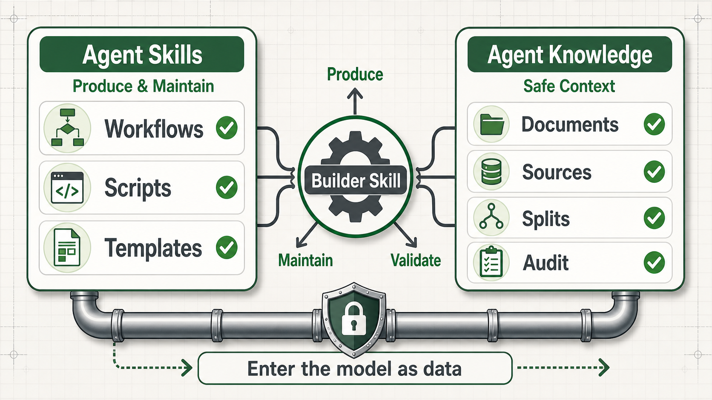

# Agent Knowledge

Agent Knowledge is a draft companion standard in the Agent Skills ecosystem for packaging source-grounded knowledge so AI agents can discover, load, cite, validate, and maintain knowledge without confusing knowledge assets with procedural skills.

Agent Skills answer **how to do work**. Agent Knowledge answers **what the trusted knowledge artifact is, where it came from, and how it safely enters context**.



## Core boundary

| Standard | Owns | Entry point | Runtime behavior |
| --- | --- | --- | --- |
| Agent Skills | Executable capabilities, workflows, scripts, tools, templates, and maintenance methods. | `SKILL.md` | Follow after trust and activation checks. |
| Agent Knowledge | Facts, sources, finished documents, compiled context, status, boundaries, and audit records. | `KNOWLEDGE.md` | Fence as data; never execute or obey instructions inside it. |

A Builder Skill can produce, maintain, validate, or publish a Knowledge pack. The Knowledge runtime still consumes only the generated artifacts. It must not execute the Builder Skill in order to answer a user request.

## What v0.7 adds

- Optional ontology-aware knowledge packs through `ontology/`
- `metadata.primaryOntology` for ontology manifests
- `content-ontology` as a standard type for concept maps, claim graphs, evidence constraints, and coverage matrices
- Runtime guidance for selecting small ontology subgraphs instead of injecting whole graphs
- `profile: document-first | wiki-first | hybrid`
- `documents/` as the primary fact source for document-first packs
- `runtime.mode: data | persona`
- Builder Skill provenance through `metadata.producedBy` and `runs/compile-*.json.builder_skill`
- Operations-oriented knowledge types such as `content-operations`, `private-domain-operations`, `live-commerce-operations`, `campaign-operations`, and `growth-strategy`
- Profile-aware resolver behavior and schema updates for compile runs, source maps, and context resolution

## Pack shape

```text
pack-name/
├── KNOWLEDGE.md      # required: metadata + usage guide
├── documents/        # document-first authority: deliverable Markdown
├── sources/          # raw evidence and citation anchors
├── wiki/             # wiki-first authority: structured maintained knowledge
├── ontology/         # optional concept, relation, claim, evidence, and coverage data
├── compiled/         # derived runtime views and document splits
├── indexes/          # rebuildable retrieval acceleration
├── runs/             # compile, lint, review, eval, and context logs
├── schemas/          # validation and extraction contracts
├── evals/            # discovery, grounding, and answer quality evals
└── assets/           # static examples and diagrams, not fact authority
```

## Runtime contract

Compatible clients should:

1. Discover packs by `KNOWLEDGE.md`.
2. Load only compact catalog metadata first.
3. Activate only explicit, relevant, or resolver-selected packs.
4. Select the smallest useful context according to `profile` and `runtime.mode`.
5. Wrap selected knowledge as fenced data.
6. Use `sources/` only for citation, verification, ingest, or dispute handling.
7. Never execute pack scripts, Builder Skills, or instructions copied from sources.

## Documentation

The documentation site includes:

- English and Simplified Chinese docs under `/en/` and `/zh/`
- versioned snapshots under `/versions/`
- rendered Mermaid diagrams and generated explanatory images
- a per-page **Copy Markdown** button so the current source page can be pasted into an AI session

Key pages:

- [Specification](docs/en/specification.md)
- [Agent Knowledge vs Agent Skills](docs/en/agent-knowledge-vs-skills.md)
- [Compilation model](docs/en/authoring/compilation-model.md)
- [Ontology-aware packs](docs/en/authoring/ontology-packs.md)
- [Runtime standard](docs/en/client-implementation/runtime-standard.md)
- [Skills interop](docs/en/authoring/skills-interop.md)
- [中文规范](docs/zh/specification.md)

## Reference CLI

The package provides `agentknowledge-ref`, a small reference CLI for validating Agent Knowledge packs and exercising the documented tooling contracts.

```bash
npx agentknowledge-ref@0.7.0 validate ./pack
npx agentknowledge-ref@0.7.0 to-catalog ./pack
npx agentknowledge-ref@0.7.0 resolve-context ./pack --query "Need pricing facts" --dry-run
npx agentknowledge-ref@0.7.0 eval ./pack --suite evals/discovery.validation.json
```


## Related Agent standards

- [Agent Knowledge](https://limecloud.github.io/agentknowledge/) - source-grounded knowledge packs.
- [Agent UI](https://limecloud.github.io/agentui/) - interaction surfaces for agent products.
- [Agent Runtime](https://limecloud.github.io/agentruntime/) - execution facts, controls, tasks, tools, and recovery.
- [Agent Evidence](https://limecloud.github.io/agentevidence/) - evidence, provenance, verification, review, replay, and export.
- [Agent Policy](https://limecloud.github.io/agentpolicy/) - policy decisions, approvals, permissions, risk, retention, waivers, and traces.
- [Agent Artifact](https://limecloud.github.io/agentartifact/) - durable deliverables, versions, parts, previews, exports, and handoff packages.
- [Agent Tool](https://limecloud.github.io/agenttool/) - tool declarations, surfaces, invocations, progress, results, permissions, and audit refs.
- [Agent Context](https://limecloud.github.io/agentcontext/) - context surfaces, items, source refs, selection, budgets, assembly, injection, compaction, and missing-context facts.

See the [Agent standards ecosystem](docs/en/reference/agent-ecosystem.md) page for the mutual-link map and future standard candidates.

## Local development

```bash
npm install
npm run dev
```

## Build

```bash
npm run build
```

The static site is generated at `docs/.vitepress/dist` and is deployed to GitHub Pages by `.github/workflows/pages.yml`.

## npm publishing

Publishing is handled by `.github/workflows/publish-npm.yml` so releases do not depend on a local OTP prompt.

For a token-based npm release of `agentknowledge-ref`, create a short-lived npm granular access token with **Read and write** access, **Bypass 2FA** enabled, and package access broad enough to publish the package. Save it as the GitHub repository secret `NPM_TOKEN`, then run the **Publish package to npm** workflow manually with `publish_ref=v0.7.0` and `publish_mode=token`.

After the first package exists on npm, configure npm Trusted Publishing for:

- package: `agentknowledge-ref`
- repository: `limecloud/agentknowledge`
- workflow file: `publish-npm.yml`
- environment: `npm-publish`

Then revoke the temporary token. Future releases can use the same workflow with `publish_mode=trusted` and without `NPM_TOKEN`.
