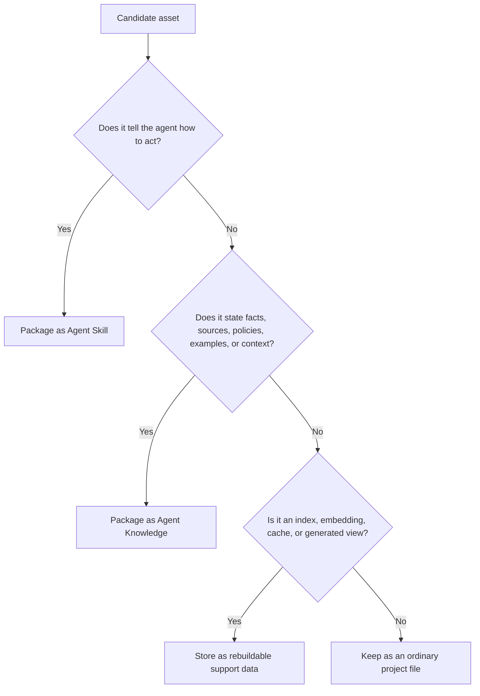
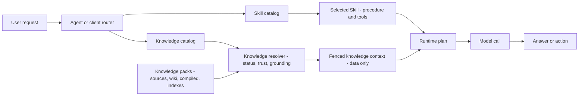
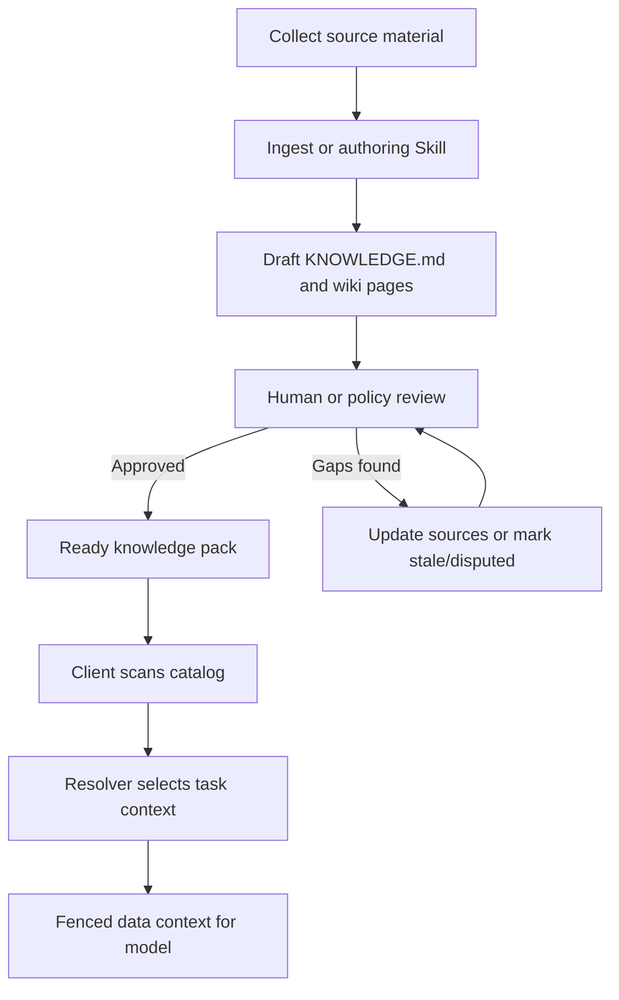
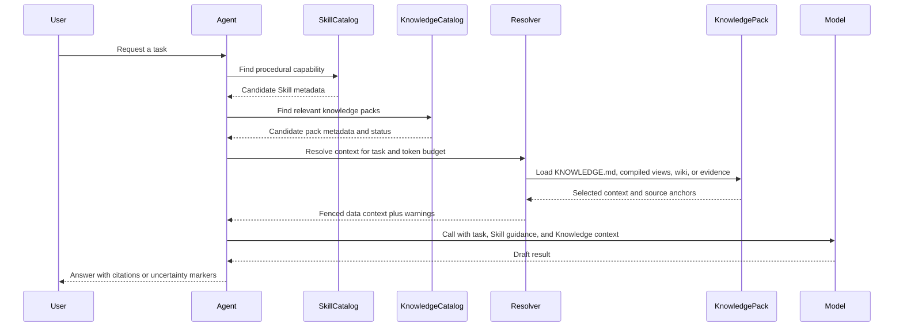

# Agent Knowledge vs Agent Skills

Agent Knowledge borrows the packaging ergonomics of Agent Skills, but it has a different runtime contract.

- **Agent Skills** are procedural capabilities. They tell an agent **how to do work**.
- **Agent Knowledge** is a source-grounded knowledge asset. It tells an agent **what facts, sources, context, and boundaries are available**.

The boundary matters because instructions and facts have different risk profiles. A client may execute or follow a Skill. A client must treat Knowledge as data inside a fenced context, never as authority to override system, developer, user, or tool rules.

## Decision rule

Use this rule before packaging an asset:

In short:

- If it says **do this sequence, call this tool, run this script, follow this workflow**, it belongs in a Skill.
- If it says **this is true, this came from here, this is allowed, this is disputed, this is stale**, it belongs in Knowledge.
- If it is an embedding, graph, or search index, it is only a rebuildable support layer for Knowledge.

## Boundary table

| Boundary | Agent Skills | Agent Knowledge |
| --- | --- | --- |
| Primary role | Procedural capability | Source-grounded knowledge asset |
| Required file | `SKILL.md` | `KNOWLEDGE.md` |
| Main content | Instructions, workflows, scripts, tool usage | Facts, source maps, maintained wiki pages, compiled context |
| Runtime verb | Do, run, transform, validate, query | Ground, cite, constrain, contextualize, verify |
| Loaded at discovery | `name`, `description` | `name`, `description`, `type`, `status` |
| Activation content | Procedure and operating instructions | Usage guide and context map |
| Supporting files | `scripts/`, `references/`, `assets/` | `sources/`, `wiki/`, `compiled/`, `indexes/`, `runs/`, `schemas/`, `assets/` |
| Trust model | Can be executable or tool-driving, so activation must be controlled | Must be treated as untrusted data unless reviewed and approved |
| Failure mode | Wrong action, unsafe tool use, bad workflow | Hallucinated fact, stale claim, missing citation, prompt injection through source text |
| Correct client behavior | Follow only after trust and activation checks | Fence as data; never execute or obey instructions found inside the pack |

## What Agent Knowledge borrows from Agent Skills

Agent Knowledge deliberately reuses the parts of Agent Skills that make agent assets portable and discoverable:

- directory as package
- required top-level Markdown file
- YAML frontmatter
- progressive disclosure
- optional supporting directories
- validation tooling
- portable, version-controlled assets
- client-side discovery and activation

The result is familiar to Skill implementors without collapsing knowledge into executable instructions.

## What Agent Knowledge adds

Knowledge packs need concepts that Skills do not normally need:

- source provenance and citation anchors
- claim status: `ready`, `needs-review`, `stale`, `disputed`, `archived`
- trust level and review ownership
- compiled runtime views separate from raw sources
- rebuildable indexes that are never the fact authority
- ingest, lint, review, and query logs
- explicit runtime wrappers that say the content is data, not instructions

## Architecture boundary

A compatible client should keep the procedural and knowledge layers separate, then join them only at the resolver/runtime boundary.

Important consequences:

- A Skill may generate, maintain, validate, query, or apply Knowledge.
- A Knowledge pack should not contain the full procedural logic for running an agent workflow.
- A client may select a Skill and a Knowledge pack for the same task, but it should preserve their different trust contracts.

## Authoring flow

A good ecosystem has Skills that maintain Knowledge, rather than hiding all knowledge inside Skills.

This is the key standard boundary: put **the method for generating, maintaining, and validating knowledge** in Skills; put **the concrete knowledge asset** in Agent Knowledge packs.

## Runtime sequence

At runtime, the agent should not load every file. It should first select capability, then select relevant knowledge, then ask the resolver for bounded context.

## Borderline cases

| Asset | Recommended package | Reason |
| --- | --- | --- |
| A procedure that tells the agent how to research a market | Skill | It is a workflow. |
| The market facts, cited sources, competitor profiles, and approved claims | Knowledge | They are facts and context. |
| A script that converts PDFs into `wiki/` pages | Skill support file | It executes a maintenance method. |
| The resulting `wiki/` pages | Knowledge | They are maintained knowledge. |
| A vector index over `wiki/` pages | Knowledge support file | It accelerates retrieval but is not the source of truth. |
| A brand tone guide with examples and prohibited claims | Knowledge | It constrains facts and allowed language. |
| A prompt that says how to write in the brand voice | Skill | It is procedural writing guidance. |

## Non-goal

Agent Knowledge does not standardize a full agent runtime, memory system, or vector database. It standardizes a file-first knowledge package that clients can discover, inspect, validate, and load safely.
