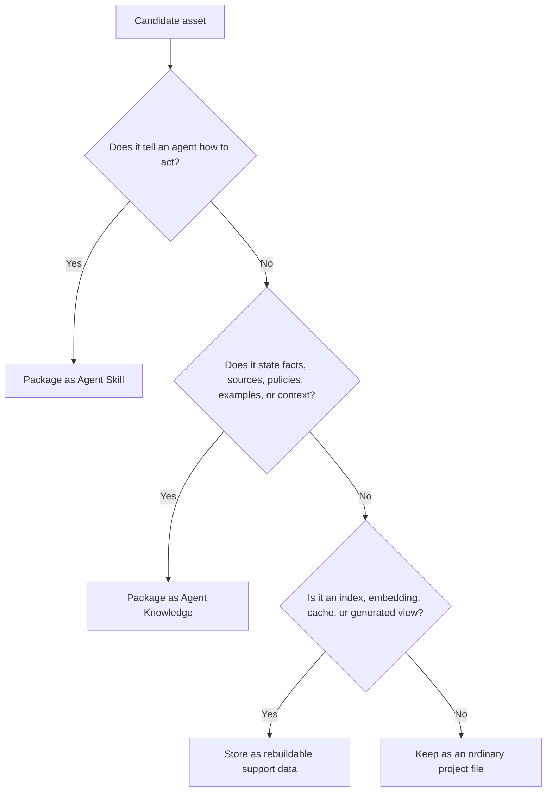
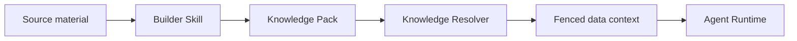
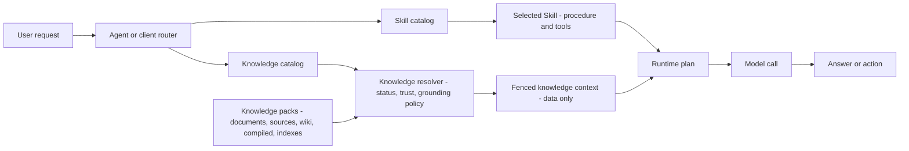
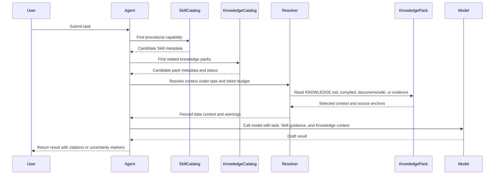

# Agent Knowledge vs Agent Skills

Agent Knowledge is an interoperable companion standard to Agent Skills. It is not a subset of Agent Skills and not another Skill package format.

- **Agent Skills** describe executable capabilities and workflows: how an agent should act, which tools to call, which scripts to run, and how to maintain assets.
- **Agent Knowledge** describes source-backed, auditable knowledge assets that can safely enter context: what is true, where it came from, what state it is in, and what boundaries apply.

This boundary matters because instructions and facts have different risks. A client may follow a Skill after trust and activation checks. A client must fence Knowledge as data and must not let a knowledge pack override system, developer, user, or tool rules.

## Decision rule

Before packaging, use this decision tree:

```mermaid
flowchart TD
  Asset["Candidate asset"] --> ActQ{"Does it tell an agent how to act?"}
  ActQ -->|Yes| Skill["Package as Agent Skill"]
  ActQ -->|No| FactQ{"Does it state facts, sources, policies, examples, or context?"}
  FactQ -->|Yes| Knowledge["Package as Agent Knowledge"]
  FactQ -->|No| CacheQ{"Is it an index, embedding, cache, or generated view?"}
  CacheQ -->|Yes| Support["Store as rebuildable support data"]
  CacheQ -->|No| Ordinary["Keep as an ordinary project file"]
```

Simplified rule:

- If the content says **follow these steps, call this tool, run this script, use this workflow**, it belongs in a Skill.
- If the content says **this is true, this is the source, this is allowed, this is disputed, this is stale**, it belongs in Knowledge.
- If the content is an embedding, graph, or search index, it is rebuildable acceleration data, not fact authority.

## Boundary table

| Boundary | Agent Skills | Agent Knowledge |
| --- | --- | --- |
| Primary role | Executable capability and method | Source-backed knowledge asset |
| Entry file | `SKILL.md` | `KNOWLEDGE.md` |
| Core content | Instructions, workflows, scripts, tool use | Facts, sources, finished documents, wiki pages, compiled context |
| Runtime verbs | execute, run, transform, validate, maintain, apply | ground, cite, constrain, contextualize, verify |
| Discovery loads | `name`, `description`, and Skill metadata | `name`, `description`, `type`, `status`, `profile`, `runtime.mode` |
| Activation provides | Procedures and operational guidance | Usage guide and bounded context |
| Support directories | `scripts/`, `references/`, `assets/` | `documents/`, `sources/`, `wiki/`, `compiled/`, `indexes/`, `runs/`, `schemas/`, `evals/` |
| Trust model | May execute scripts or drive tools; activation must be controlled | Treat as untrusted data unless reviewed and confirmed |
| Failure modes | Wrong action, unsafe tool call, bad workflow | Fabricated facts, stale claims, missing citations, prompt injection in source text |
| Correct client behavior | Follow only after trust and activation checks | Fence as data; never execute or obey instructions inside it |

## What Agent Knowledge borrows from Agent Skills

Agent Knowledge reuses the parts of Agent Skills that make assets portable and discoverable:

- directory-as-package
- top-level Markdown entry file
- YAML frontmatter
- progressive loading
- optional support directories
- validation tools
- versioned and shareable assets
- client discovery and activation mechanics

Agent Knowledge does not reuse Skill execution semantics. `KNOWLEDGE.md` is not an alias for `SKILL.md`, and knowledge pack content is not a procedure to follow.

## What Agent Knowledge adds

Knowledge packs need concepts Skills usually do not:

- source provenance and citation anchors
- status states: `ready`, `needs-review`, `stale`, `disputed`, `archived`
- trust levels and review ownership
- `document-first` / `wiki-first` profiles
- `runtime.mode: data | persona`
- finished documents, wiki pages, and compiled runtime views separated from raw sources
- rebuildable indexes; indexes are never fact authority
- import, lint, review, compile, and query logs
- an explicit runtime wrapper that says knowledge is data, not instructions

## Builder Skill and Knowledge Pack

A Skill can generate, maintain, validate, query, or apply Knowledge. The standard recommends recording Builder Skill provenance, but it does not require every Knowledge pack to be Skill-generated.

```mermaid
flowchart LR
  Sources["Source material"] --> BuilderSkill["Builder Skill"]
  BuilderSkill --> Pack["Knowledge Pack"]
  Pack --> Resolver["Knowledge Resolver"]
  Resolver --> Fenced["Fenced data context"]
  Fenced --> AgentRuntime["Agent Runtime"]
```

Rules:

1. Put production methods in Skills; put concrete knowledge assets in Knowledge packs.
2. `runs/compile-*.json` SHOULD record the Builder Skill name, version, digest, inputs, outputs, and diagnostics.
3. A Knowledge runtime MUST NOT execute the Builder Skill when consuming the pack.
4. Hand-authored, imported, synced, or manually maintained Knowledge packs remain valid; Builder Skill provenance is an enhancement, not a requirement.

## Architecture boundary

Compatible clients SHOULD separate the capability layer from the knowledge layer and combine them only at resolver/runtime boundaries.

```mermaid
flowchart LR
  UserRequest["User request"] --> Router["Agent or client router"]
  Router --> SkillCatalog["Skill catalog"]
  Router --> KnowledgeCatalog["Knowledge catalog"]
  SkillCatalog --> SelectedSkill["Selected Skill - procedure and tools"]
  KnowledgeCatalog --> Resolver["Knowledge resolver - status, trust, grounding policy"]
  KnowledgePacks["Knowledge packs - documents, sources, wiki, compiled, indexes"] --> Resolver
  Resolver --> FencedContext["Fenced knowledge context - data only"]
  SelectedSkill --> RuntimePlan["Runtime plan"]
  FencedContext --> RuntimePlan
  RuntimePlan --> ModelCall["Model call"]
  ModelCall --> Result["Answer or action"]
```

Direct conclusions:

- A Skill can generate, maintain, validate, query, or apply Knowledge.
- A Knowledge pack SHOULD NOT carry a full agent workflow.
- A client may select both a Skill and a Knowledge pack for the same task, but it must preserve their different trust contracts.

## Runtime sequence

The runtime SHOULD select capabilities first, then related knowledge, then let the resolver pick context under task and token budgets.

```mermaid
sequenceDiagram
  participant User
  participant Agent
  participant SkillCatalog
  participant KnowledgeCatalog
  participant Resolver
  participant Pack as KnowledgePack
  participant Model

  User->>Agent: Submit task
  Agent->>SkillCatalog: Find procedural capability
  SkillCatalog-->>Agent: Candidate Skill metadata
  Agent->>KnowledgeCatalog: Find related knowledge packs
  KnowledgeCatalog-->>Agent: Candidate pack metadata and status
  Agent->>Resolver: Resolve context under task and token budget
  Resolver->>Pack: Read KNOWLEDGE.md, compiled, documents/wiki, or evidence
  Pack-->>Resolver: Selected context and source anchors
  Resolver-->>Agent: Fenced data context and warnings
  Agent->>Model: Call model with task, Skill guidance, and Knowledge context
  Model-->>Agent: Draft result
  Agent-->>User: Return result with citations or uncertainty markers
```

## Borderline cases

| Asset | Package location | Reason |
| --- | --- | --- |
| Steps for how to research a market | Skill | It is a workflow. |
| Market facts, cited sources, competitor profiles, and approved claims | Knowledge | They are facts and context. |
| A script that converts DOCX to Markdown | Skill support file | It executes a maintenance method. |
| The generated product fact document | Knowledge | It is a readable, auditable knowledge product. |
| A split index for `documents/` | Knowledge support file | It accelerates retrieval but is not fact authority. |
| A brand tone guide with examples and prohibited claims | Knowledge | It constrains facts and allowed expression. |
| A prompt that teaches how to write in the brand tone | Skill | It is procedural writing guidance. |
| Content operations calendar and review metrics | Knowledge | They are operations playbook data. |
| The method for generating a content calendar | Skill | It is the method for producing and maintaining the playbook. |

## Non-goal

Agent Knowledge does not standardize a full agent runtime, memory system, vector database, or the Agent Skills package format. It standardizes a file-first knowledge pack so clients can discover, inspect, validate, and safely load source-backed knowledge.
