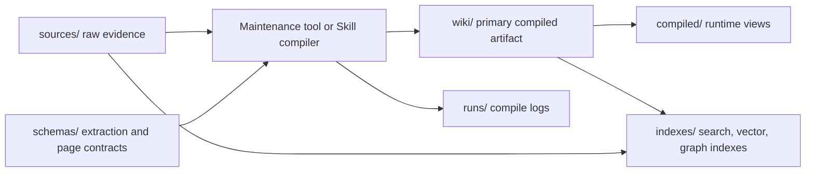
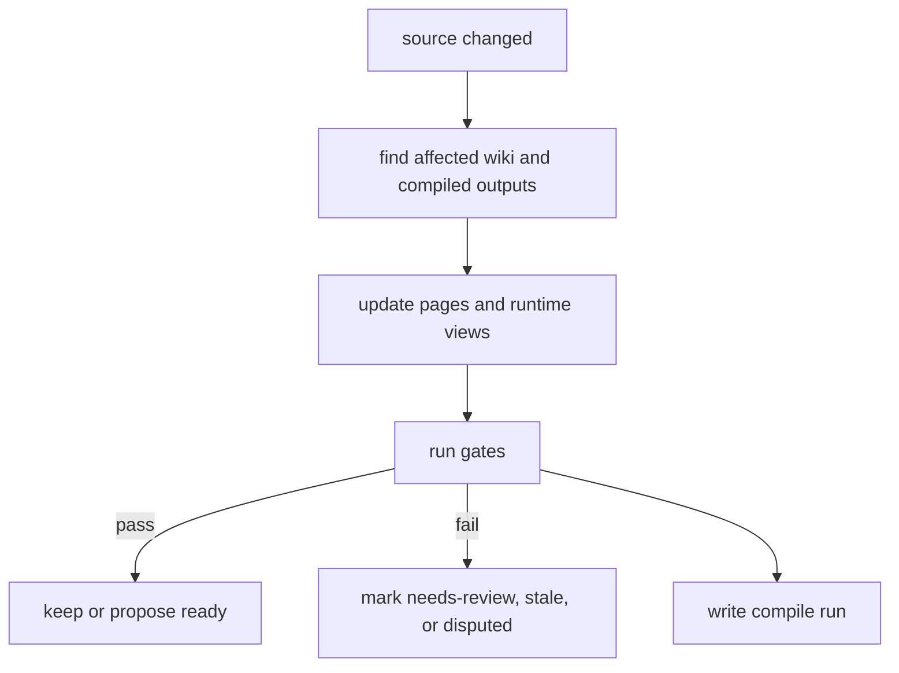

# Compilation model

Agent Knowledge is not just raw documents chunked for query-time synthesis. Its central pattern is to continuously compile source material into maintained, auditable, reusable knowledge artifacts.

In this model, `wiki/` is the primary compiled artifact, `compiled/` contains runtime-oriented derived views, `indexes/` contains rebuildable retrieval accelerators, and `runs/` records compile logs and audit evidence.

For the user-facing maintenance loop, start with the [knowledge engineering loop](/en/authoring/knowledge-engineering-loop).



## What gets compiled

A compiler can be an Agent Skill, client command, CI tool, or external script. It reads selected sources and creates or updates:

- source summaries
- entity, concept, decision, open-question, and contradiction pages
- cross-source synthesis pages
- claim source anchors and status
- compact runtime briefings, facts, and boundaries
- full-text, vector, or graph indexes
- compile run records

## Directory responsibilities

| Directory | Compile role | Authority |
| --- | --- | --- |
| `sources/` | Input. Stores raw or normalized evidence. | Yes, as raw evidence. |
| `wiki/` | Primary compiled artifact. Stores long-lived maintained knowledge IR. | Yes, as maintained knowledge. |
| `compiled/` | Derived runtime view. Compresses common `wiki/` context. | Conditional; must trace back to `wiki/` or `sources/`. |
| `indexes/` | Derived retrieval structure. Helps find candidate pages or excerpts. | No; search acceleration only. |
| `runs/` | Audit records for compile, lint, review, and eval. | No; evidence and diagnostics. |
| `schemas/` | Structural contracts for compile inputs and outputs. | Yes, as validation contracts. |

## Compiled artifacts vs runtime views

The name `compiled/` is easy to misread. It is not the only place compiled knowledge lives.

- `wiki/` is the main compiled artifact: it preserves structure, links, contradictions, open questions, and source relationships.
- `compiled/` is a runtime optimization artifact: it compresses common knowledge into short context that resolvers can prefer.
- `indexes/` is a machine acceleration artifact: it must be rebuildable from `sources/`, `wiki/`, and `compiled/`.

Normal answers can prefer `compiled/`, but maintenance, verification, dispute handling, and multi-hop synthesis should return to `wiki/` and `sources/`.

## Source map

Important claims should keep source mappings. The smallest useful form is a source anchor in Markdown:

```markdown
- Acme Widget supports offline queueing. [source: sources/reports/q1.md#L42]
```

High-risk or large packs should use structured claims:

```yaml
claim_id: clm-acme-offline-queue
text: Acme Widget supports offline queueing.
status: confirmed
source:
  path: sources/reports/q1.md
  anchor: L42
compiled_into:
  - wiki/concepts/offline-queue.md
  - compiled/facts.md
```

When `grounding: required`, a compiler must not write important unsourced claims into `ready` artifacts. It should write them to `wiki/open-questions/`, or mark the claim as `missing`, `inferred`, or `source-required`.

## Incremental compilation

Knowledge packs should support incremental updates instead of rebuilding the entire wiki every time.

When a source changes, the maintenance tool should compute the affected set:

1. Read changed `sources/` files and the existing source map.
2. Find `wiki/` pages and `compiled/` views that depend on that source.
3. Update relevant pages, contradiction records, open questions, and indexes.
4. Write affected paths, operations, and diagnostics to `runs/`.
5. If outputs fail gates, mark the pack or affected pages as `needs-review`, `stale`, or `disputed`.



## Compile gates

Before writing to `wiki/` or `compiled/`, maintenance tools should check at least:

- important claims have source anchors
- new claims do not conflict with existing ready claims, or conflicts are recorded in `wiki/contradictions/`
- `compiled/` does not copy large raw source passages
- stale sources do not silently override fresher sources
- obvious prompt injection in sources does not become runtime instruction
- likely secrets or sensitive content are blocked or marked
- output files conform to declared schemas

## Compile run record

Recommended compile runs live at `runs/compile-<timestamp>.json`:

```json
{
  "run_id": "compile-2026-05-01T10-30-00Z",
  "trigger": "ingest",
  "status": "needs-review",
  "compiler": {
    "tool": "agent-knowledge-compiler",
    "version": "0.3.0",
    "model": "gpt-5.4"
  },
  "inputs": [
    {
      "path": "sources/reports/q1.md",
      "sha256": "..."
    }
  ],
  "outputs": [
    {
      "path": "wiki/concepts/offline-queue.md",
      "operation": "updated"
    },
    {
      "path": "compiled/facts.md",
      "operation": "updated"
    }
  ],
  "diagnostics": [
    {
      "severity": "warning",
      "path": "wiki/open-questions/pricing.md",
      "message": "Pricing information is missing an official source."
    }
  ],
  "review": {
    "required": true,
    "reason": "New product capability claim"
  }
}
```

`runs/` is not fact authority. It lets maintainers and clients explain why pages changed and why some claims cannot enter a ready state.

## How resolvers use compiled artifacts

Runtime resolvers should:

1. Read the context map in `KNOWLEDGE.md`.
2. Prefer `compiled/` for normal tasks.
3. Read relevant `wiki/` pages for multi-hop, disputed, detailed, or novel questions.
4. Read `sources/` anchors when citation or verification is required.
5. Use `indexes/` only to find candidates, never as fact authority.
6. Return warnings when a `compiled/` source map points to stale or disputed pages.

## Non-goals

Agent Knowledge does not mandate a specific compiler, vector store, graph database, or model. The standard defines portable artifact boundaries and audit contracts: what the inputs are, what the outputs are, how to trace them, and how to judge whether outputs are trustworthy.
