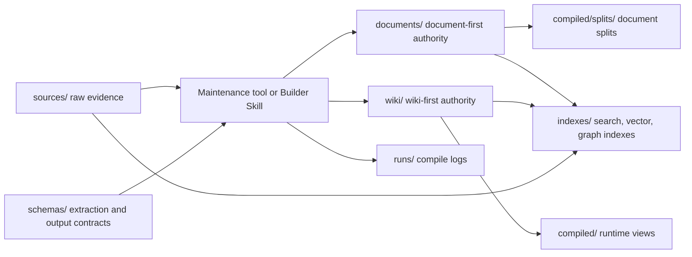
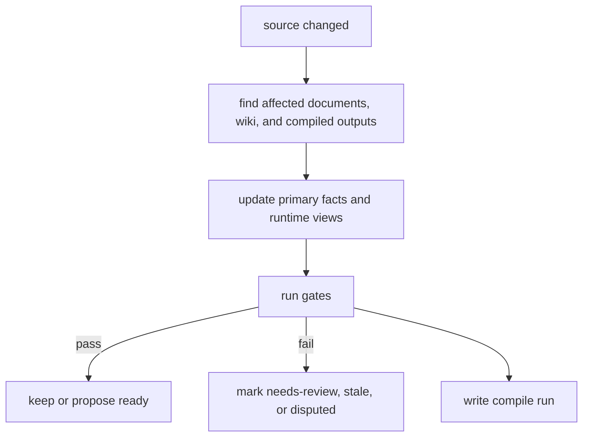

# Compilation model

Agent Knowledge uses a compile-first model. Source material is compiled into maintained, auditable, reusable knowledge assets before a resolver selects the smallest useful runtime context.

Since v0.6, the compilation model is **profile-aware**:

- `document-first`: `documents/` is the primary fact source for readable, editable, deliverable Markdown documents.
- `wiki-first`: `wiki/` is the primary fact source for long-lived structured knowledge IR.
- `hybrid`: both `documents/` and `wiki/` can be primary fact sources, but the pack must state which side is preferred for which task.

`compiled/` is not the only compiled output. It is the runtime-oriented derived view. `indexes/` contains rebuildable retrieval accelerators, and `runs/` records compile, lint, review, and eval evidence.

For the user-facing maintenance loop, start with the [knowledge engineering loop](/en/authoring/knowledge-engineering-loop).


```mermaid
flowchart LR
  Sources["sources/ raw evidence"] --> Compiler["Maintenance tool or Builder Skill"]
  Schemas["schemas/ extraction and output contracts"] --> Compiler
  Compiler --> Documents["documents/ document-first authority"]
  Compiler --> Wiki["wiki/ wiki-first authority"]
  Documents --> Splits["compiled/splits/ document splits"]
  Wiki --> Compiled["compiled/ runtime views"]
  Documents --> Indexes["indexes/ search, vector, graph indexes"]
  Wiki --> Indexes
  Sources --> Indexes
  Compiler --> Runs["runs/ compile logs"]
```

## Relationship to Agent Skills

A compiler MAY be an Agent Skill, client command, CI tool, or external script. The recommended Builder Skill follows the Agent Skills standard: `SKILL.md` describes the workflow, `references/` stores templates and checklists, `scripts/` stores executable maintenance helpers, and `assets/` stores skeletons or examples.

Keep the boundary clear:

- Agent Skills describe how to produce, maintain, validate, and publish knowledge.
- Agent Knowledge describes what the knowledge artifact looks like, how it is traced, and how it safely enters context.
- A Knowledge runtime MUST NOT execute a Skill, script, or instruction found in source text in order to consume knowledge.
- Builder Skill provenance SHOULD be recorded in `KNOWLEDGE.md.metadata.producedBy` and `runs/compile-*.json`, but hand-authored, imported, or manually maintained packs remain valid.

## What gets compiled

Maintenance tools read selected sources and create or update:

- finished Markdown documents, SOPs, operations playbooks, customer deliverables, or persona handbooks under `documents/`
- source summaries, entities, concepts, decisions, open questions, contradictions, and synthesis pages under `wiki/`
- claim source anchors, status, and coverage
- compact runtime briefings, facts, boundaries, or `compiled/splits/`
- full-text, vector, or graph indexes
- compile run records, diagnostics, and review requirements

## Directory responsibilities

| Directory | Compile role | Authority |
| --- | --- | --- |
| `sources/` | Input. Stores raw or normalized evidence. | Yes, as raw evidence. |
| `documents/` | Primary fact source for `document-first`. Stores readable, editable, deliverable documents. | Yes, for document-first or hybrid packs. |
| `wiki/` | Primary fact source for `wiki-first`. Stores long-lived maintained knowledge IR. | Yes, for wiki-first or hybrid packs. |
| `compiled/` | Derived runtime view. Compresses common context from `documents/` or `wiki/`. | Conditional; must trace back to the primary fact source or `sources/`. |
| `indexes/` | Derived retrieval structure. Helps find candidate pages, sections, or excerpts. | No; search acceleration only. |
| `runs/` | Audit records for compile, lint, review, and eval. | No; evidence and diagnostics. |
| `schemas/` | Structural contracts for compile inputs and outputs. | Yes, as validation contracts. |

## Compiled artifacts vs runtime views

The name `compiled/` is easy to misread. It is not the only place compiled knowledge lives.

- In `document-first`, `documents/` is the primary fact source: it preserves narrative, sections, deliverable format, and human editability.
- In `wiki-first`, `wiki/` is the primary fact source: it preserves structure, links, contradictions, open questions, and source relationships.
- `compiled/` is a runtime optimization artifact: it compresses common knowledge into short context that resolvers can prefer.
- `indexes/` is a machine acceleration artifact: it must be rebuildable from `sources/`, the primary fact source, and `compiled/`.

Normal answers MAY prefer `compiled/` or `compiled/splits/`, but maintenance, verification, dispute handling, and multi-hop synthesis SHOULD return to `documents/`, `wiki/`, and `sources/`.

## Profile compilation paths

| Profile | Recommended path | Use cases |
| --- | --- | --- |
| `document-first` | `sources/ -> documents/ -> compiled/splits/ + indexes/` | Personal IP, brand persona, product facts, operations SOPs, customer-deliverable packs. |
| `wiki-first` | `sources/ -> wiki/ -> compiled/ + indexes/` | Large research corpora, multi-entity knowledge graphs, long-running synthesis libraries. |
| `hybrid` | `sources/ -> documents/ + wiki/ -> compiled/ + indexes/` | Complex packs that need both deliverable documents and structured long-term maintenance. |

`runtime.mode` is independent from profile. `persona` means the runtime must protect voice, persona, taboos, and expression boundaries; `data` means facts, SOPs, policies, product information, or operations playbooks. Both still enter context as data, never as system instructions.

## Source map

Important claims SHOULD keep source mappings. The smallest useful form is a source anchor in Markdown:

```markdown
- Acme Widget supports offline queueing. [source: sources/reports/q1.md#L42]
```

High-risk or large packs SHOULD use structured claims:

```yaml
claim_id: clm-acme-offline-queue
text: Acme Widget supports offline queueing.
status: confirmed
source:
  path: sources/reports/q1.md
  anchor: L42
compiled_into:
  - documents/product-brief.md#offline-capabilities
  - compiled/splits/product-brief/offline-capabilities.md
  - compiled/facts.md
```

When `grounding: required`, a compiler MUST NOT write important unsourced claims into `ready` artifacts. It SHOULD write them to `documents/open-questions.md`, `wiki/open-questions/`, or mark the claim as `missing`, `inferred`, or `source-required`.

## Incremental compilation

Knowledge packs SHOULD support incremental updates instead of rebuilding all knowledge every time.

When a source changes, the maintenance tool SHOULD compute the affected set:

1. Read changed `sources/` files and the existing source map.
2. Use the pack `profile` to find affected `documents/` sections, `wiki/` pages, and `compiled/` views.
3. Update relevant documents, pages, contradiction records, open questions, and indexes.
4. Write affected paths, operations, Builder Skill provenance, and diagnostics to `runs/`.
5. If outputs fail gates, mark the pack, document, or page as `needs-review`, `stale`, or `disputed`.


```mermaid
flowchart TD
  Change["source changed"] --> Impact["find affected documents, wiki, and compiled outputs"]
  Impact --> Update["update primary facts and runtime views"]
  Update --> Gates["run gates"]
  Gates -->|pass| Ready["keep or propose ready"]
  Gates -->|fail| Review["mark needs-review, stale, or disputed"]
  Gates --> Runs["write compile run"]
```

## Compile gates

Before writing to `documents/`, `wiki/`, or `compiled/`, maintenance tools SHOULD check at least:

- important claims have source anchors
- new claims do not conflict with existing ready claims, or conflicts are recorded as open questions, contradictions, or review notes
- `compiled/` and `compiled/splits/` do not copy large raw source passages
- stale sources do not silently override fresher sources
- obvious prompt injection in sources does not become runtime instruction
- likely secrets or sensitive content are blocked or marked
- output files conform to declared schemas, profile, and `runtime.mode`

## Compile run record

Recommended compile runs live at `runs/compile-<timestamp>.json`:

```json
{
  "run_id": "compile-2026-05-01T10-30-00Z",
  "trigger": "ingest",
  "status": "needs-review",
  "profile": "document-first",
  "runtime_mode": "data",
  "builder_skill": {
    "name": "brand-product-knowledge-builder",
    "version": "0.7.1",
    "digest": "sha256:..."
  },
  "compiler": {
    "tool": "agent-knowledge-compiler",
    "version": "0.7.1",
    "model": "gpt-5.4"
  },
  "inputs": [
    {
      "path": "sources/reports/q1.md",
      "sha256": "..."
    }
  ],
  "outputs": [
    {
      "path": "documents/product-brief.md",
      "operation": "updated"
    },
    {
      "path": "compiled/splits/product-brief/offline-capabilities.md",
      "operation": "updated"
    }
  ],
  "diagnostics": [
    {
      "severity": "warning",
      "path": "documents/product-brief.md",
      "message": "Pricing information is missing an official source."
    }
  ],
  "review": {
    "required": true,
    "reason": "New product capability claim"
  }
}
```

`runs/` is not fact authority. It lets maintainers and clients explain why documents or pages changed and why some claims cannot enter a ready state.

## How resolvers use compiled artifacts

Runtime resolvers SHOULD:

1. Read `profile`, `runtime.mode`, and the context map in `KNOWLEDGE.md`.
2. For `document-first`, prefer `compiled/splits/`; if needed, read task-relevant sections from `metadata.primaryDocument` under `documents/`.
3. For `wiki-first`, prefer `compiled/` for normal tasks and read related `wiki/` pages for complex tasks.
4. For `hybrid`, choose `documents/` or `wiki/` by task intent; never load the whole pack eagerly.
5. Read `sources/` anchors when citation or verification is required.
6. Use `indexes/` only to find candidates, never as fact authority.
7. Return warnings when the source map points to stale or disputed content.

## Non-goals

Agent Knowledge does not mandate a specific compiler, vector store, graph database, or model. The standard defines portable artifact boundaries and audit contracts: what the inputs are, what the outputs are, how to trace them, how to judge whether outputs are trustworthy, and how to interoperate with the Agent Skills ecosystem without turning knowledge consumption into code execution.
