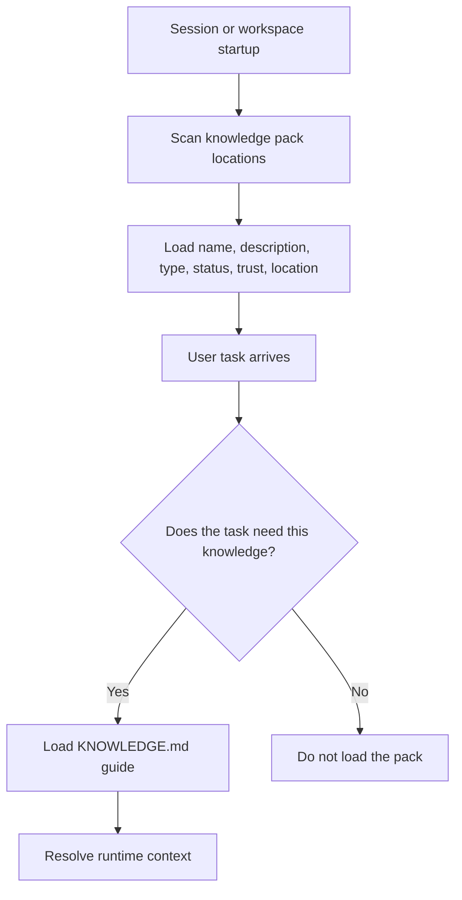
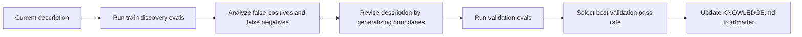

# Description and discovery

Agent Knowledge uses the same progressive-disclosure idea that makes Agent Skills practical: clients should see compact metadata first, then load the full pack only when the task needs it.

That makes `description` a high-leverage field. It is not marketing copy. It is the discovery contract that helps the agent decide whether a knowledge pack is relevant.

## How discovery works



A weak description causes false negatives: the agent misses a pack it should use. An over-broad description causes false positives: the agent loads irrelevant or risky knowledge.

## Description rules

A good knowledge-pack description should state:

- what knowledge the pack contains
- when agents should use it
- which user intents or domains it covers
- important boundaries or near-misses
- whether grounding, citations, or review status matter

Good:

```yaml
description: Product facts, approved positioning, pricing boundaries, support language, and source-backed claims for Acme Widget. Use when writing Acme marketing copy, sales replies, support answers, partner briefs, or when checking whether an Acme claim is approved.
```

Poor:

```yaml
description: Acme knowledge.
```

## Keep the field compact

The `description` field has a maximum of 1024 characters. Keep it short enough to fit in catalogs containing many packs.

Do not put full instructions, source excerpts, or long taxonomies into `description`. Put those in `KNOWLEDGE.md`, `compiled/`, or `wiki/`.

## Discovery evals

Borrow the trigger-eval pattern from Agent Skills and adapt it to knowledge selection.

Create an optional `evals/discovery.json` file:

```json
{
  "pack_name": "acme-product-brief",
  "queries": [
    {
      "query": "Can you draft a partner launch email for Acme Widget without inventing pricing?",
      "should_select": true
    },
    {
      "query": "Can you explain how to implement OAuth PKCE in a mobile app?",
      "should_select": false
    }
  ]
}
```

Use about 20 queries for a serious pack: 8-10 should select the pack, 8-10 should not.

## Positive queries

Positive queries should vary:

- explicit mentions: "use the Acme product brief"
- implicit intent: "write a support answer about Acme warranty"
- casual phrasing and typos
- short tasks and longer multi-step tasks
- tasks where the pack is helpful but not obvious from exact keywords

## Negative queries

The best negative queries are near-misses. They share terms with the pack but should not load it.

For a brand/product pack, strong negative cases include:

- internal engineering work that mentions the product name but needs code context
- generic business writing that does not require approved brand facts
- competitor research that should not use Acme claims as facts
- legal or compliance advice outside the pack's reviewed scope

## Train and validation split

Do not tune a description against every query. Split discovery evals into:

- `evals/discovery.train.json` for iteration
- `evals/discovery.validation.json` for generalization checks

Use the train set to identify failures. Use the validation set only to choose the best version. This reduces overfitting to exact phrases.

## Optimization loop



When false negatives occur, the description is probably too narrow. When false positives occur, it is probably too broad or missing boundaries.

Avoid adding exact words from failed queries. Add the broader category they represent.

## What to log

Write discovery-eval results under `runs/`:

```text
runs/
└── discovery-eval-2026-05-01.json
```

Recommended fields:

```json
{
  "pack_name": "acme-product-brief",
  "description_hash": "sha256:...",
  "runs_per_query": 3,
  "threshold": 0.5,
  "summary": {
    "true_positive": 9,
    "false_negative": 1,
    "true_negative": 8,
    "false_positive": 2,
    "pass_rate": 0.85
  }
}
```

Because model behavior can vary, run each query multiple times when possible and compute a selection rate.
