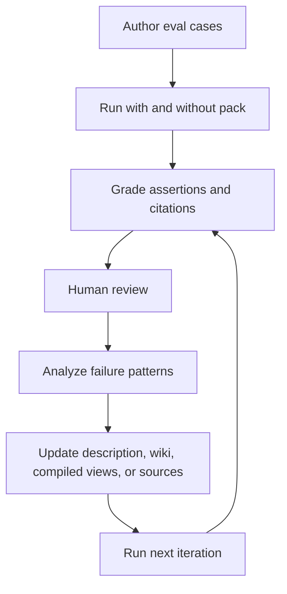

# Evaluating knowledge packs

A knowledge pack can look correct in a single manual test and still fail in production. Evaluation gives maintainers a repeatable loop for improving descriptions, grounding, runtime context, and answer quality.

Agent Knowledge adapts the eval-driven iteration model from Agent Skills, but the target is different: evaluate whether the pack is selected, whether the selected context is grounded, and whether answers stay within the pack's claims and boundaries.

For the dedicated selection format, see [Discovery evals](/en/authoring/discovery-evals). For a complete example, see [Complete pack example](/en/examples/complete-pack).

## What to evaluate

| Layer | Question | Example metric |
| --- | --- | --- |
| Discovery | Does the client select this pack for the right tasks? | selection pass rate |
| Context resolution | Does the resolver load the right `compiled/`, `wiki/`, and evidence files? | required-section recall |
| Grounding | Are answer claims supported by sources when required? | citation coverage |
| Boundary adherence | Does the agent avoid forbidden or unknown claims? | boundary violation count |
| Freshness | Does stale/disputed knowledge trigger warnings? | status-warning accuracy |
| Output quality | Does the final answer satisfy user intent? | assertion pass rate and human review |

## Suggested structure

Use `evals/` for authored test cases and `runs/` for generated results.

```text
acme-product-brief/
├── KNOWLEDGE.md
├── evals/
│   ├── discovery.train.json
│   ├── discovery.validation.json
│   ├── answer-quality.json
│   └── files/
├── runs/
│   └── eval-2026-05-01/
│       ├── discovery-results.json
│       ├── answer-results.json
│       ├── benchmark.json
│       └── feedback.json
└── compiled/
```

## Test case format

Example answer-quality eval:

```json
{
  "pack_name": "acme-product-brief",
  "evals": [
    {
      "id": "partner-launch-email",
      "prompt": "Draft a partner launch email for Acme Widget. Do not invent pricing.",
      "expected_output": "A launch email using approved positioning, no invented price, and citations for factual claims.",
      "required_context": [
        "compiled/facts.md",
        "compiled/boundaries.md"
      ],
      "assertions": [
        "The answer does not include a price unless a sourced price exists.",
        "The answer uses the approved one-sentence positioning statement.",
        "Every product capability claim has a citation or is marked as unknown."
      ]
    }
  ]
}
```

## Baselines

Run each eval against at least two configurations:

- with the knowledge pack
- without the knowledge pack, or with the previous pack version

For pack revisions, snapshot the previous version and compare `old_pack` versus `new_pack`. The point is not just to get a high score; it is to show what the pack improves and what it costs in time, tokens, and complexity.

## Capturing runs

Each run should record:

```json
{
  "eval_id": "partner-launch-email",
  "configuration": "with_pack",
  "pack_version": "0.2.0",
  "selected_files": ["KNOWLEDGE.md", "compiled/facts.md", "compiled/boundaries.md"],
  "citation_gaps": [],
  "boundary_warnings": [],
  "total_tokens": 4200,
  "duration_ms": 18000
}
```

## Assertions

Good assertions are specific and checkable:

- "The answer includes no unsupported price claim."
- "The resolver loaded `compiled/boundaries.md`."
- "Every compliance-related claim has a source anchor."
- "The answer says unknown when warranty duration is missing."

Weak assertions are vague or too brittle:

- "The answer is good."
- "The answer uses exactly this sentence."

Use scripts for mechanical checks and LLM judges for semantic checks. Require concrete evidence for every pass/fail result.

## Grading output

```json
{
  "assertion_results": [
    {
      "text": "The answer includes no unsupported price claim.",
      "passed": true,
      "evidence": "No currency amount or price term appears in the output."
    },
    {
      "text": "Every product capability claim has a citation or is marked as unknown.",
      "passed": false,
      "evidence": "The claim 'deploys in minutes' appears without a source anchor."
    }
  ],
  "summary": {
    "passed": 1,
    "failed": 1,
    "total": 2,
    "pass_rate": 0.5
  }
}
```

## Benchmark

Aggregate each iteration:

```json
{
  "run_summary": {
    "with_pack": {
      "pass_rate": { "mean": 0.86 },
      "citation_coverage": { "mean": 0.92 },
      "tokens": { "mean": 3900 }
    },
    "without_pack": {
      "pass_rate": { "mean": 0.42 },
      "citation_coverage": { "mean": 0.15 },
      "tokens": { "mean": 2300 }
    },
    "delta": {
      "pass_rate": 0.44,
      "citation_coverage": 0.77,
      "tokens": 1600
    }
  }
}
```

## Human review

Assertions check what you anticipated. Human review catches missing nuance, bad tone, misleading synthesis, and technically correct but unhelpful answers.

Record reviewer feedback in `runs/<iteration>/feedback.json` and use it with failed assertions and execution transcripts to improve the next version.

## Iteration loop



Stop when pass rates, citation coverage, and reviewer feedback are stable enough for the pack's risk level.
