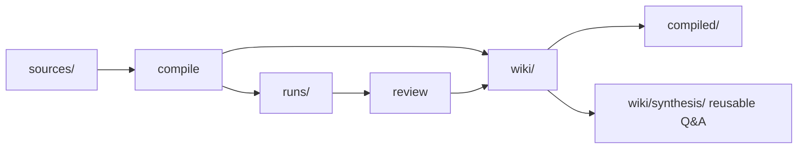

# Knowledge engineering loop

Many knowledge bases fail not because they lack content, but because content decays: sources pile up, summaries scatter, concepts get defined twice, answers stay trapped in chat history, and a few months later it is hard to know which claims are still trustworthy.

Agent Knowledge borrows from the LLM Wiki pattern: treat a knowledge base as a continuously compiled engineering system. Humans choose sources and review important results; agents and tools handle repetitive summarization, linking, checking, and filing.

## Engineering analogy

| Software engineering | Agent Knowledge | Meaning |
| --- | --- | --- |
| `src/` | `sources/` | Raw input and evidence from pages, meetings, papers, interviews, or internal docs. |
| `build/` | `wiki/` and `compiled/` | `wiki/` is the primary compiled artifact; `compiled/` is the derived runtime view. |
| build logs | `runs/` | Compile, lint, review, eval, and health-check records. |
| compiler | Agent Skill, client tool, CI, or script | Reads sources and updates wiki, compiled views, and indexes. |
| IDE | any editor or client | This can be Obsidian, a filesystem, a web app, or a desktop client. |
| lint / CI | health checks and evals | Detect missing sources, contradictions, orphan pages, stale claims, and injection risks. |

In personal workflows, `raw/` often maps to `sources/`, and `outputs/` can map to `runs/`, `wiki/synthesis/`, or `compiled/`. The standard does not require these aliases or any specific editor.

## Minimal loop

A sustainable knowledge pack should run four steps:

1. **Ingest sources**: put raw material in `sources/`, preserving source URL, author, publication time, capture time, and license information.
2. **Compile knowledge**: incrementally compile sources into `wiki/` pages such as source summaries, concepts, entities, open questions, and contradictions.
3. **Derive runtime views**: generate short `compiled/` files from `wiki/`, such as `facts.md`, `briefing.md`, and `boundaries.md`.
4. **Check and file back**: write lint, health-check, eval, and useful answer artifacts back into the pack.



## Turning answers into inventory

A complex answer that only remains in chat history is usually lost. Agent Knowledge recommends filing reusable answers, but not treating every output as fact.

Recommended rules:

- temporary diagnostics, compile logs, and health reports go to `runs/`
- reusable, sourced synthesis goes to `wiki/synthesis/`
- frequently loaded short conclusions can be derived into `compiled/`
- unconfirmed, unsourced, or disputed answers must carry status and must not enter `ready` runtime views

Example:

```markdown
---
question: When should we use RAG instead of lightweight indexes?
asked_at: 2026-05-01
status: needs-review
sources:
  - sources/articles/local-indexing.md#L12
  - wiki/concepts/rag.md
---

# RAG and lightweight indexes

## TL;DR

For small and medium packs, prefer `wiki/index.md`, full-text search, and explicit source maps. Add vector retrieval only when scale, semantic retrieval needs, or recall requirements exceed lightweight indexes.

## Evidence

- ...

## Uncertainty

- No local benchmark yet for packs above ten thousand notes.
```

## Health checks

Health checks are not decorative. They are the cheapest way to keep a knowledge pack trustworthy over time.

Check regularly for:

- **consistency**: conflicting definitions for the same concept
- **completeness**: important pages missing definitions, examples, or sources
- **islands**: pages with too few inbound or outbound links
- **freshness**: stale sources or claims
- **traceability**: important claims that cannot trace back to `sources/`
- **security**: prompt injection, secrets, or sensitive content in sources

Health-check results should be written to `runs/health-<date>.json` or `runs/health-<date>.md`. If a check finds serious issues, the maintenance tool should propose `needs-review`, `stale`, or `disputed`.

## Do not start with RAG

Agent Knowledge does not reject RAG, but a vector database should not be the first step.

For small packs, start with:

- `wiki/index.md`
- `wiki/concepts/`
- `wiki/sources/`
- lightweight full-text search
- source maps

Add `indexes/vector/` as a rebuildable acceleration layer only when scale, recall difficulty, or multilingual semantic search needs exceed those mechanisms. A vector index is still not fact authority.

## Two-week pilot

Week one: run `sources/ -> wiki/`.

- Create one small knowledge pack.
- Add 5 to 10 high-quality sources.
- Compile source summaries, concept pages, and an index.
- Record the first `runs/compile-...json`.

Week two: run filing and checks.

- Write complex answers into `wiki/synthesis/` with sources and status.
- Generate the first health-check report.
- Fix missing sources, orphan pages, and conflicting claims.
- Derive short conclusions into `compiled/` only after review.

The goal is not to build a large system immediately. It is to establish a durable loop: ingest, compile, use, file back, and check.
