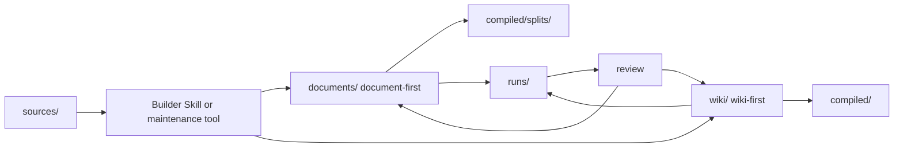

# Knowledge engineering loop

Treat a knowledge pack as a continuously compiled system. Humans choose sources and review important results. Builder Skills or maintenance tools handle summarization, linking, checking, and filing.

The v0.6 loop no longer assumes all knowledge goes through `wiki/` first. Choose a profile, then decide the primary fact source:

- `document-first`: produce `documents/` first, then derive `compiled/splits/`.
- `wiki-first`: produce `wiki/` first, then derive `compiled/`.
- `hybrid`: maintain both `documents/` and `wiki/`, but keep clear task boundaries.

## Engineering analogy

| Software engineering | Agent Knowledge | Meaning |
| --- | --- | --- |
| `src/` | `sources/` | Raw input and evidence from pages, meetings, papers, interviews, or internal docs. |
| `build/` | `documents/`, `wiki/`, and `compiled/` | `documents/` or `wiki/` is the profile-selected primary fact source; `compiled/` is the derived runtime view. |
| build logs | `runs/` | Compile, lint, review, eval, and health-check records. |
| compiler | Builder Skill, client tool, CI, or script | Reads sources and updates primary facts, compiled views, and indexes. |
| IDE | any editor or client | This can be Obsidian, a filesystem, a web app, or a desktop client. |
| lint / CI | health checks and evals | Detect missing sources, contradictions, orphan pages, stale claims, and injection risks. |

In personal workflows, `raw/` often maps to `sources/`, and `outputs/` can map to `runs/`, `documents/`, `wiki/synthesis/`, or `compiled/`. The standard does not require these aliases or any specific editor.

## Minimal loop

A maintained knowledge pack SHOULD run four steps:

1. **Ingest sources**: put raw material in `sources/`, preserving source URL, author, publication time, capture time, and license information.
2. **Compile the primary fact source**: compile into `documents/` or `wiki/` according to `profile`.
3. **Derive runtime views**: generate short `compiled/` files or `compiled/splits/` from the primary fact source.
4. **Check and file back**: write lint, health-check, eval, and useful answer artifacts back into the pack.


```mermaid
flowchart LR
  Sources["sources/"] --> Compile["Builder Skill or maintenance tool"]
  Compile --> Documents["documents/ document-first"]
  Compile --> Wiki["wiki/ wiki-first"]
  Documents --> Splits["compiled/splits/"]
  Wiki --> Compiled["compiled/"]
  Documents --> Runs["runs/"]
  Wiki --> Runs
  Runs --> Review["review"]
  Review --> Documents
  Review --> Wiki
```

## Profile decision

| Profile | Maintain first | Common packs |
| --- | --- | --- |
| `document-first` | One or more complete Markdown documents. | Personal IP, brand persona, brand product, content operations, private-domain operations, SOPs, customer deliverables. |
| `wiki-first` | Structured pages, entities, concepts, source summaries, and synthesis relationships. | Large research corpora, multi-entity knowledge graphs, organization know-how, long-running research libraries. |
| `hybrid` | Deliverable documents plus structured wiki pages. | Large packs that need both external deliverables and long-term multi-hop maintenance. |

Choosing `document-first` does not mean giving up structure; it can still have `indexes/`, source maps, and `compiled/splits/`. Choosing `wiki-first` does not mean documents are forbidden; finished documents can exist as exports or secondary fact sources under `documents/`.

## Turning answers into inventory

Reusable answers MAY be filed back into the pack. They MUST NOT become `ready` facts without source and review status.

Recommended rules:

- temporary diagnostics, compile logs, and health reports go to `runs/`
- in `document-first` packs, reusable, sourced, deliverable synthesis goes to the appropriate section or appendix under `documents/`
- in `wiki-first` packs, reusable, sourced synthesis goes to `wiki/synthesis/`
- frequently loaded short conclusions can be derived into `compiled/` or `compiled/splits/`
- unconfirmed, unsourced, or disputed answers must carry status and must not enter `ready` runtime views

Example:

```markdown
---
question: When do we use RAG instead of lightweight indexes?
asked_at: 2026-05-01
status: needs-review
sources:
  - sources/articles/local-indexing.md#L12
  - wiki/concepts/rag.md
---

# RAG and lightweight indexes

## TL;DR

For small and medium packs, prefer `documents/` or `wiki/index.md`, full-text search, and explicit source maps. Add vector retrieval only when scale, semantic retrieval needs, or recall requirements exceed lightweight indexes.

## Evidence

- ...

## Uncertainty

- No local benchmark yet for packs above ten thousand notes.
```

## Builder Skill as maintenance craft

If a Skill maintains the knowledge pack, keep the “how” inside the Skill instead of embedding it in the Knowledge pack:

- `SKILL.md`: ingest, interview, organize, check, and publish workflow.
- `references/`: templates, quality checklists, interview questions.
- `scripts/`: format conversion, linting, splitting, index generation.
- `assets/`: blank skeletons, example packs, import config.

The Knowledge pack records artifacts and provenance, such as `metadata.producedBy` and `runs/compile-*.json.builder_skill`. The runtime MUST NOT execute the Builder Skill when consuming Knowledge.

## Health checks

Health checks keep status and source quality explicit.

Check regularly for:

- **consistency**: conflicting definitions, product facts, operations policies, or persona boundaries
- **completeness**: important documents or pages missing definitions, examples, or sources
- **coverage**: `compiled/` or `compiled/splits/` covers common runtime tasks
- **islands**: pages or sections with too few links or source maps
- **freshness**: stale sources or claims
- **traceability**: important claims that cannot trace back to `sources/`
- **security**: prompt injection, secrets, or sensitive content in sources

Health-check results SHOULD be written to `runs/health-<date>.json` or `runs/health-<date>.md`. If a check finds serious issues, the maintenance tool SHOULD propose `needs-review`, `stale`, or `disputed`.

## Do not start with RAG

Agent Knowledge does not reject RAG. A vector database SHOULD NOT be the first step.

For small packs, start with:

- `documents/` section structure and `compiled/splits/`
- `wiki/index.md` and `wiki/concepts/`
- lightweight full-text search
- source maps
- clear pack `description`, `type`, `profile`, and `runtime.mode`

Add `indexes/vector/` as a rebuildable acceleration layer only when scale, recall difficulty, or multilingual semantic search needs exceed those mechanisms. A vector index is still not fact authority.

## Two-week pilot

Week one: run `sources/ -> primary fact source`.

- Create one small knowledge pack.
- Choose `document-first` or `wiki-first`.
- Add 5 to 10 high-quality sources.
- Compile one primary document or a set of wiki pages.
- Record the first `runs/compile-...json`.

Week two: run filing and checks.

- Write complex answers into `documents/` or `wiki/synthesis/` with sources and status.
- Generate the first health-check report.
- Fix missing sources, orphan pages, and conflicting claims.
- Derive short conclusions into `compiled/` or `compiled/splits/` only after review.

Goal: establish the loop `ingest -> compile -> use -> file back -> check`, while Skills own the craft and Knowledge owns the artifact.
