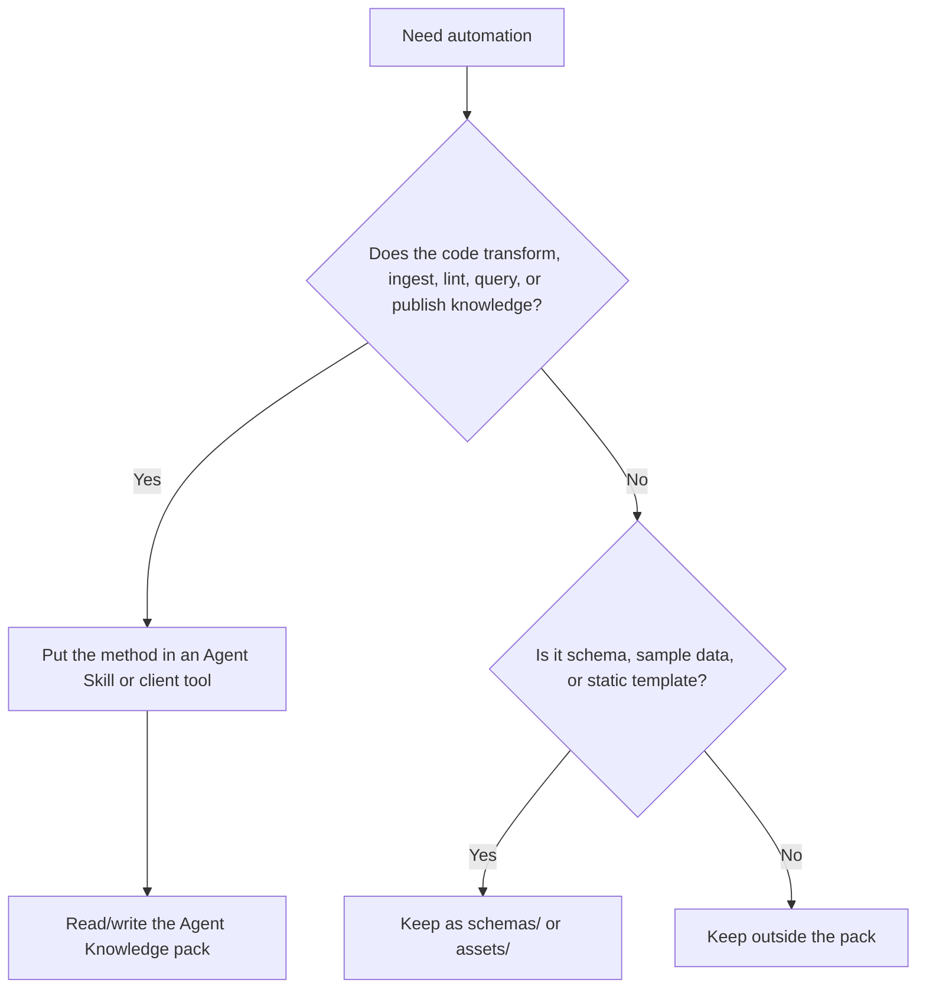

# Maintenance automation

Agent Skills supports bundled scripts because Skills are procedural assets. Agent Knowledge has a stricter boundary: the knowledge pack is primarily data. Maintenance logic should normally live in an Agent Skill, a client command, CI, or an external tool that reads and writes the pack.

This page adapts the Agent Skills script guidance to knowledge maintenance. For knowledge packs, the most important automation is often compilation: incrementally turning `sources/` into `wiki/`, `compiled/`, and `indexes/`, then writing the process to `runs/`.

If the maintenance workflow needs a full Skill, start with [Skills interop](/en/authoring/skills-interop). For script interface details, see the [maintenance script contract](/en/authoring/maintenance-script-contract).

## Boundary rule



Do not make clients execute code from a knowledge pack during discovery or activation.

## Recommended placement

| Asset | Recommended home | Reason |
| --- | --- | --- |
| PDF ingestion script | Agent Skill `scripts/` or client tool | It is a method. |
| Knowledge compiler | Agent Skill `scripts/`, client tool, or CI | It turns sources into wiki pages, runtime views, and indexes. |
| Citation linter | Agent Skill `scripts/`, CI, or client tool | It performs validation. |
| JSON schema for extracted claims | Knowledge pack `schemas/` | It describes data shape. |
| Static prompt template for a review workflow | Agent Skill or `assets/` with clear non-executable status | It is procedural if it tells the agent what to do. |
| Generated lint output | Knowledge pack `runs/` | It is audit evidence. |
| Discovery or answer-quality test cases | Knowledge pack `evals/` | They define expected behavior. |

## Compiler interface contract

If a maintenance tool performs compilation, prefer a stable subcommand or arguments:

```bash
agent-knowledge compile \
  --pack ./acme-product-brief \
  --changed sources/reports/q1.md \
  --output-run runs/compile-2026-05-01T10-30-00Z.json
```

The compiler should:

- support `--dry-run` to show which `wiki/`, `compiled/`, and `indexes/` files would change
- record input file hashes, output files, operations, and diagnostics
- preserve source maps so important claims trace back to `sources/` anchors
- update the affected set incrementally to avoid unrelated page drift
- suggest `needs-review`, `stale`, or `disputed` when gates fail
- never run automatically during pack discovery or activation

## One-off commands

For simple maintenance, document pinned one-off commands in the maintaining Skill or project docs:

```bash
npx markdownlint-cli2@0.14.0 "wiki/**/*.md" "compiled/**/*.md"
uvx ruff@0.8.0 check tools/knowledge_lint.py
```

Rules:

- pin versions when the command affects review results
- state prerequisites explicitly
- move complex command sequences into tested scripts
- write results to `runs/` when they affect pack status

## Script interface contract

When a Skill or client tool provides scripts for knowledge maintenance, the scripts should be agent-friendly:

- no interactive prompts
- `--help` with concise usage and examples
- structured output, preferably JSON for machine use
- diagnostics on stderr, data on stdout
- deterministic paths relative to the pack root
- `--dry-run` for writes or destructive changes
- bounded output with `--limit`, `--offset`, or `--output`
- idempotent operations where possible

Example linter invocation:

```bash
python scripts/lint_knowledge.py \
  --pack ./acme-product-brief \
  --grounding required \
  --output runs/lint-2026-05-01.json
```

Example JSON result:

```json
{
  "status": "needs-review",
  "findings": [
    {
      "severity": "error",
      "path": "compiled/facts.md",
      "message": "Pricing claim is missing a source anchor."
    }
  ]
}
```

Example compile result:

```json
{
  "run_id": "compile-2026-05-01T10-30-00Z",
  "status": "needs-review",
  "inputs": [
    {
      "path": "sources/reports/q1.md",
      "sha256": "..."
    }
  ],
  "outputs": [
    {
      "path": "wiki/concepts/offline-queue.md",
      "operation": "updated"
    },
    {
      "path": "compiled/facts.md",
      "operation": "updated"
    }
  ],
  "diagnostics": [
    {
      "severity": "warning",
      "path": "wiki/open-questions/pricing.md",
      "message": "Pricing information is missing an official source."
    }
  ]
}
```

## Self-contained scripts

If a maintenance Skill bundles scripts, prefer self-contained dependency declarations:

- Python scripts can use PEP 723 metadata and run with `uv run`.
- Node tools can use pinned `npx package@version` for one-off commands.
- Deno scripts can pin `npm:` or `jsr:` imports.
- Go tools can use `go run module@version`.

Agent Knowledge does not require any of these runtimes. They belong to the maintaining toolchain, not the data format.

## Status changes

Automation may propose a status change, but clients should not silently mark a pack `ready` unless the owner policy allows it.

Recommended policy:

| Transition | Automation allowed? | Human review |
| --- | --- | --- |
| `draft` -> `needs-review` | Yes | Optional |
| `needs-review` -> `ready` | Only with explicit policy | Recommended |
| `ready` -> `stale` | Yes, if source freshness check fails | Notify owner |
| `ready` -> `disputed` | Yes, if contradiction is detected | Required to resolve |
| any -> `archived` | No by default | Required |

## Runs are evidence, not authority

`runs/` records what a tool did. It does not replace the reviewed knowledge in `wiki/` or `compiled/`.

A resolver may surface run findings as warnings, but the current pack status and selected context still come from `KNOWLEDGE.md` and maintained files.
