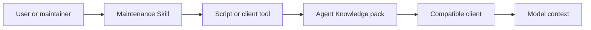

# Skills interop

Agent Knowledge and Agent Skills should have clear responsibilities.

- **Agent Knowledge** stores facts, sources, compiled artifacts, status, review, and traceability records.
- **Agent Skills** store procedures, scripts, tool calls, prompt templates, and maintenance methods.

A healthy ecosystem should use Skills to maintain Knowledge, not hide concrete customer, brand, research, or organizational knowledge inside global Skills.

## Layer model

A maintenance Skill can create, compile, lint, evaluate, and publish knowledge packs. A compatible client still treats knowledge as data during discovery and activation, and must not execute content found inside a knowledge pack.

## Companion Skill

We recommend capturing maintenance workflows in a companion Skill such as `agent-knowledge-maintainer`.

It can provide:

- creating a knowledge pack
- importing sources and normalizing metadata
- compiling `sources/ -> wiki/ -> compiled/ + indexes/`
- running health and citation checks
- running discovery, context, and answer evals
- generating version snapshots and changelogs

These capabilities belong to the procedural layer and should live in a Skill, client command, CI, or external tool. The knowledge pack can store schemas, eval cases, run records, and sample data, but should not require clients to execute bundled scripts.

## Script boundary

If a companion Skill uses scripts, scripts should follow the [maintenance script contract](/en/authoring/maintenance-script-contract):

- write operations support `--dry-run`
- output machine-readable JSON
- diagnostics go to stderr
- dependencies and runners are pinned
- network access and credential use are declared explicitly

## What stays out of the pack core

The following may exist in Skills or toolchains, but should not become required Agent Knowledge protocol:

- a `scripts/` directory
- a specific LLM, editor, vector store, or graph database
- a specific package manager
- concrete importers, crawlers, or converters
- proprietary commands for one client

The portable Agent Knowledge unit remains a plain directory with Markdown and JSON artifacts.

## Interop principles

- A Skill can write a knowledge pack, but a knowledge pack cannot require a client to execute a Skill.
- Skill output must leave `runs/` records explaining what was read, what changed, and why review is needed.
- The pack's `status`, `trust`, and `grounding` remain determined by pack metadata and review results.
- A client may call a maintenance Skill, but runtime answers should read maintained knowledge artifacts through a resolver.
