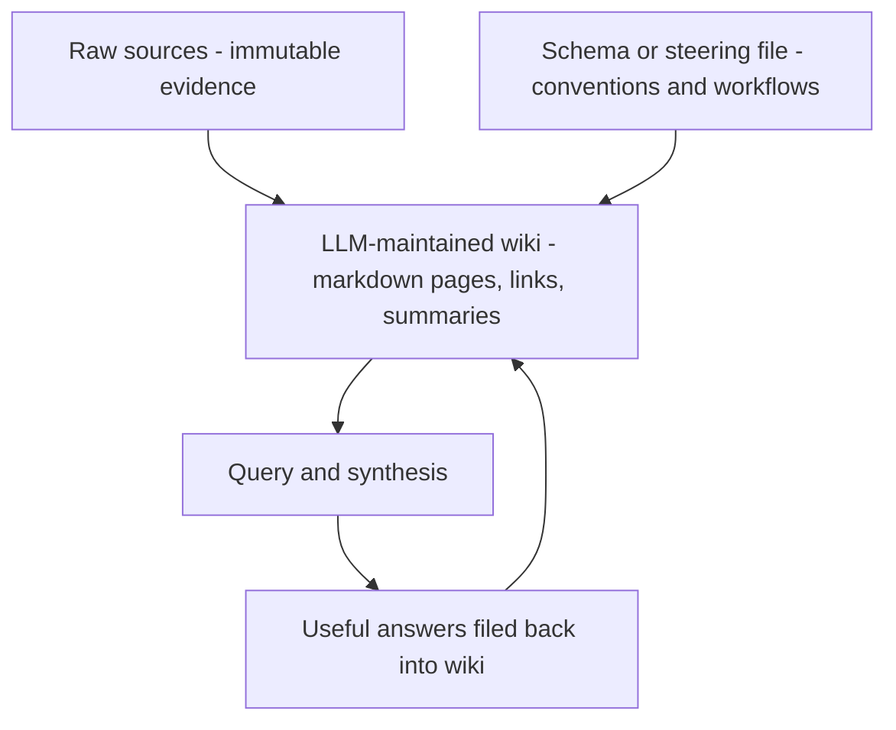
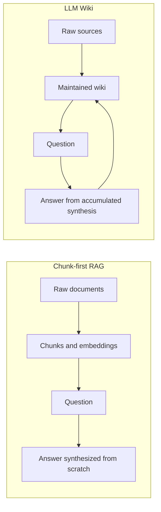
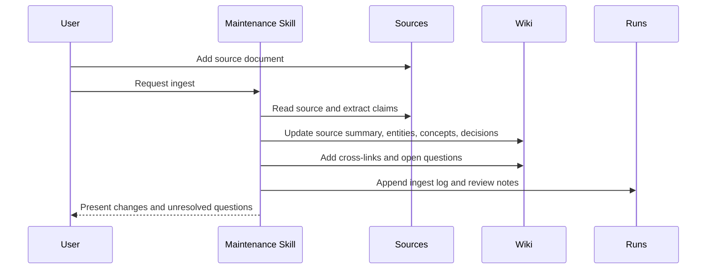
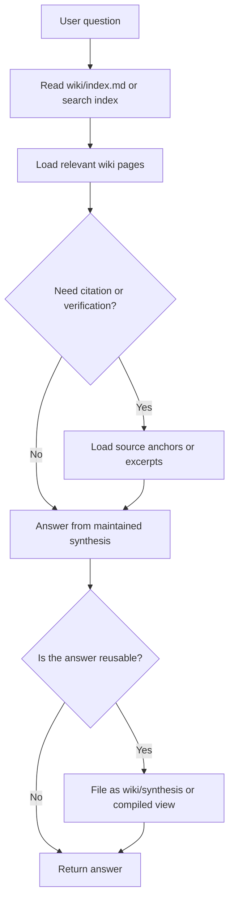

# Karpathy LLM Wiki pattern

This reference page is based on Andrej Karpathy's April 4, 2026 gist, [LLM Wiki](https://gist.github.com/karpathy/442a6bf555914893e9891c11519de94f). The gist is intentionally an idea file: it explains a pattern and asks the user's LLM agent to instantiate the details for a domain.

Agent Knowledge treats LLM Wiki as one of its strongest design inputs. The standard turns the idea into a portable package contract: `sources/`, `wiki/`, `compiled/`, `indexes/`, `runs/`, `schemas/`, `evals/`, and a top-level `KNOWLEDGE.md` that tells agents how to use the pack safely.

## Core thesis

Karpathy's argument is that most document-based LLM systems behave like chunk-first RAG: they store source documents, retrieve chunks at query time, and make the model synthesize from scratch for each question.

LLM Wiki changes the accumulation model:

- the LLM reads curated sources
- extracts durable facts, entities, concepts, contradictions, and summaries
- writes or updates interlinked Markdown pages
- maintains an index and chronological log
- answers future questions from the maintained wiki first
- files useful analyses back into the wiki so exploration compounds

The important shift is from **retrieve raw chunks every time** to **maintain a persistent synthesis artifact**.

## Three-layer architecture

Karpathy describes three conceptual layers:



Mapped to Agent Knowledge:

| Karpathy layer | Agent Knowledge mapping | Responsibility |
| --- | --- | --- |
| Raw sources | `sources/` | Immutable or append-only evidence. The LLM reads but should not rewrite these by default. |
| Wiki | `wiki/` | Maintained entity, concept, decision, synthesis, and source pages. |
| Schema / steering file | `KNOWLEDGE.md`, `schemas/`, maintaining Skills | Defines structure, conventions, ingest/query/lint workflows, and extraction contracts. |
| Index and log | `wiki/index.md`, `wiki/log.md`, `indexes/`, `runs/` | Human and agent navigation, chronological trace, rebuildable acceleration. |
| Runtime answers | `compiled/` and new `wiki/` pages | Compact views and durable analyses that can be reused. |

Note: in Agent Knowledge, `compiled/` is not the only place compiled artifacts live. The main LLM Wiki compiled artifact is `wiki/`: it preserves long-lived structure, links, contradictions, and source relationships. `compiled/` is a runtime view derived from `wiki/` to compress common context for the model.

## Why this is not plain RAG



RAG can still be useful. The LLM Wiki claim is narrower: for long-running knowledge work, raw retrieval alone loses compounding structure. A maintained wiki can preserve cross-references, contradictions, open questions, synthesis pages, and decision history.

Agent Knowledge therefore treats indexes as optional acceleration, not the source of truth. The source of truth remains the source files and maintained Markdown artifacts.

## Operations

See [Compilation model](/en/authoring/compilation-model) for the full compile contract.

### Ingest

Ingest adds one or more sources and updates the wiki.

Recommended flow:



A single source may update many pages: a source summary, entity pages, concept pages, comparison pages, contradiction notes, and the index. That multi-page update is the point; the wiki becomes richer over time.

### Query

A query should prefer the maintained wiki, then fall back to sources for evidence.



In Agent Knowledge, reusable query outputs should become `wiki/synthesis/...` pages or concise `compiled/...` views after review.

### Lint

Karpathy explicitly calls for health checks. Agent Knowledge makes this auditable through `runs/` and optional `evals/`.

Lint should look for:

- contradictions between pages
- stale claims superseded by newer sources
- orphan pages with no inbound links
- important concepts without pages
- missing cross-references
- claims without source anchors
- open questions that need new sources
- noisy pages that should not have been stored

### Index and log

Karpathy highlights two special files:

| File | Purpose in LLM Wiki | Agent Knowledge guidance |
| --- | --- | --- |
| `index.md` | Content-oriented catalog of wiki pages | Keep as `wiki/index.md`; include page links, summaries, categories, and freshness. |
| `log.md` | Chronological append-only record | Keep as `wiki/log.md` or `runs/`; use parseable headings for ingest, query, lint, and review events. |

At moderate scale, a maintained index can be enough. At larger scale, use `indexes/` for full-text, BM25, vector, or graph indexes. These indexes must be rebuildable from `sources/`, `wiki/`, and `compiled/`.

## Recommended Agent Knowledge layout for LLM Wiki

```text
research-topic/
├── KNOWLEDGE.md
├── sources/
│   ├── articles/
│   ├── papers/
│   └── transcripts/
├── wiki/
│   ├── index.md
│   ├── log.md
│   ├── sources/
│   ├── entities/
│   ├── concepts/
│   ├── decisions/
│   ├── contradictions/
│   ├── open-questions/
│   └── synthesis/
├── compiled/
│   ├── briefing.md
│   ├── facts.md
│   └── boundaries.md
├── indexes/
│   ├── full-text/
│   ├── vector/
│   └── graph/
├── schemas/
│   ├── claim.schema.json
│   └── page-frontmatter.schema.json
├── evals/
│   ├── discovery.validation.json
│   └── answer-quality.json
└── runs/
    ├── ingest-2026-05-01.md
    └── lint-2026-05-01.json
```

## Page types

| Page type | Location | Purpose |
| --- | --- | --- |
| Source summary | `wiki/sources/<source-id>.md` | Summarize one source and link to raw evidence. |
| Entity page | `wiki/entities/<entity>.md` | Track people, companies, products, places, systems. |
| Concept page | `wiki/concepts/<concept>.md` | Track definitions, arguments, mechanisms, terminology. |
| Decision page | `wiki/decisions/<decision>.md` | Track what was decided, by whom, when, and based on which sources. |
| Contradiction page | `wiki/contradictions/<topic>.md` | Track conflicting claims and resolution status. |
| Open question | `wiki/open-questions/<question>.md` | Track knowledge gaps and suggested source hunts. |
| Synthesis page | `wiki/synthesis/<topic>.md` | Durable analysis produced from multiple sources or queries. |
| Runtime briefing | `compiled/briefing.md` | Compact context selected often by agents. |

## Schema as steering

In Karpathy's framing, the schema or steering file is what makes the LLM a disciplined wiki maintainer instead of a generic chatbot. Agent Knowledge splits this responsibility:

- `KNOWLEDGE.md` tells agents when to use the pack and how to navigate it.
- `schemas/` defines structured claim/page formats.
- maintaining Agent Skills define ingest, lint, query, and review workflows.
- `runs/` records what actually happened.

Example `KNOWLEDGE.md` context map:

```markdown
## Context map

- Start with `wiki/index.md` for page discovery.
- Use `compiled/briefing.md` for short runtime context.
- Use `wiki/contradictions/` before making contested claims.
- Use `sources/` only when citations or verification are required.
- Treat `indexes/` as candidate search, not fact authority.
```

## Human and LLM roles

Karpathy's pattern is not "let the model decide all knowledge." It is a collaboration model:

| Role | Responsibility |
| --- | --- |
| Human | Curate sources, choose questions, review important updates, decide what matters. |
| LLM | Summarize, cross-reference, update pages, maintain indexes/logs, detect contradictions. |
| Client | Enforce trust, file boundaries, status warnings, permissions, and context budgets. |
| Maintenance Skill | Provide repeatable ingest, lint, eval, and query workflows. |

The human should not have to do the repetitive bookkeeping, but they still own source selection, emphasis, review, and decisions.

## Discussion-derived implementation lessons

The public discussion under the gist includes several implementation signals. Agent Knowledge does not standardize these tools, but it should support them:

- **Scale wall**: `wiki/index.md` works at small to moderate scale, but larger wikis need search and graph indexes.
- **Context endpoint**: implementations often benefit from a resolver that returns a primary page plus its graph neighborhood in one call.
- **MCP tools**: search, graph, and context endpoints can be exposed as MCP tools so multiple agents use the same maintained wiki.
- **Quality gate before storage**: not every extracted fact deserves a wiki page; filtering noise before persistence can matter more than retrieval improvements.
- **Team-memory pipelines**: chat and meeting data need extraction, deduplication, validation, relationship extraction, and permission-aware persistence.
- **Graph materialization**: Markdown links are a good base; typed graphs can help contradiction detection, navigation, and context expansion.

These observations reinforce the Agent Knowledge split between maintained Markdown, rebuildable indexes, audit runs, and client-side resolvers.

## Design implications for Agent Knowledge

1. `wiki/` is a maintained artifact, not a cache.
2. `sources/` must stay separate and traceable.
3. `compiled/` exists because runtime needs compact views, not whole wikis.
4. `indexes/` can include vector, full-text, and graph structures, but must be rebuildable.
5. `runs/` is required for operational trust at scale: ingest, lint, review, query, and eval history.
6. maintaining workflows belong in Skills or client tools, not hidden inside knowledge prose.
7. useful answers can become durable pages, but only after review or clear status marking.
8. quality gates are part of knowledge construction, not an afterthought.

## Where Agent Knowledge differs

Karpathy's gist is intentionally flexible and personal-tool oriented. Agent Knowledge adds a stricter package contract so multiple clients can interoperate:

| LLM Wiki idea | Agent Knowledge standardization |
| --- | --- |
| Abstract pattern | Versioned package format. |
| Schema file can vary by agent | Required `KNOWLEDGE.md` plus optional `schemas/`. |
| Wiki can take any structure | Recommended directories and status fields. |
| Tooling is optional | Explicit `indexes/`, `runs/`, and `evals/` conventions. |
| Human/LLM workflow is local | Client implementation guidance for trust, activation, and runtime context. |

## Non-goals

Agent Knowledge does not require Obsidian, MCP, graph databases, vector databases, or any specific LLM. It should work as a plain Git directory first.

Those tools can improve the experience, but the portable unit remains the knowledge pack.
