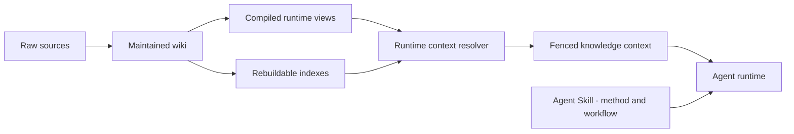

# What is Agent Knowledge?

Agent Knowledge is a portable directory format for packaging durable knowledge assets for AI agents.

It is designed for knowledge that should survive across sessions:

- brand and product facts
- organization know-how
- personal or expert profiles
- research wikis
- support and sales playbooks
- policy and compliance references
- long-lived domain context

It is not a replacement for Agent Skills. Agent Skills tell an agent how to perform work. Agent Knowledge tells an agent what facts, sources, context, and boundaries it may rely on.

## The problem

Many systems put all knowledge into one of two places:

- a vector database with little human-readable structure
- a prompt or skill file that mixes facts with instructions

Both break down when knowledge must be maintained, reviewed, cited, and shared across agents.

Agent Knowledge separates layers:

```text
raw sources -> maintained wiki -> compiled runtime views -> optional indexes
```

## Core architecture



The Skill layer provides methods and workflows. The Knowledge layer provides source-grounded context. The agent runtime combines them only after trust, status, and grounding checks.

## Core principles

1. Files first: a pack is a directory people and agents can inspect.
2. Sources stay separate: raw source material is evidence, not runtime prompt by default.
3. Knowledge is data: clients must treat loaded knowledge as context, not instructions.
4. Progressive disclosure: metadata first, usage guide second, context/evidence only as needed.
5. Indexes are rebuildable: vector, graph, and full-text indexes accelerate retrieval but are not facts.
6. Review state is explicit: draft, ready, stale, disputed, and archived knowledge behave differently.
7. Skills remain procedural: use skills to ingest, lint, query, and apply knowledge packs.
