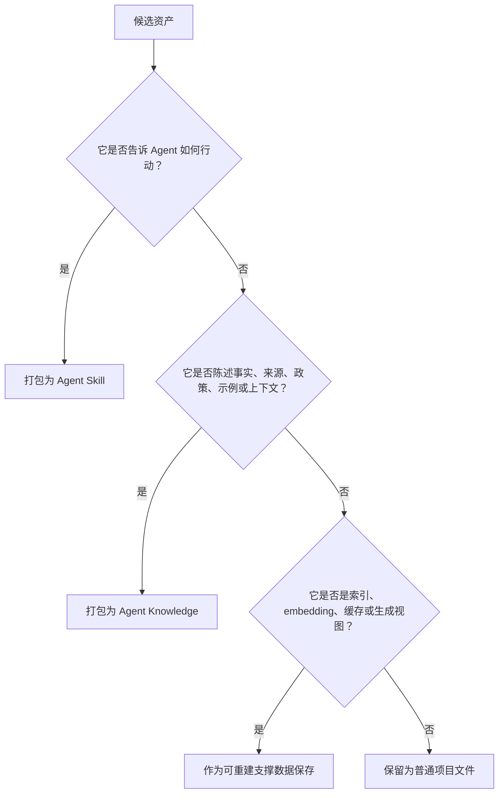
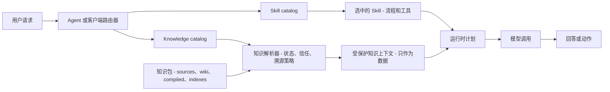
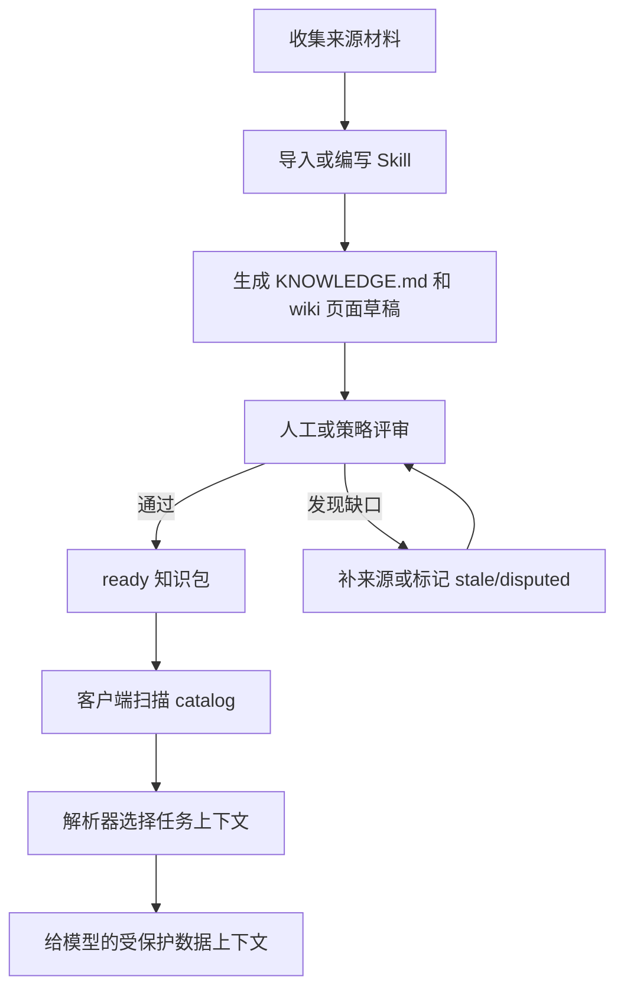
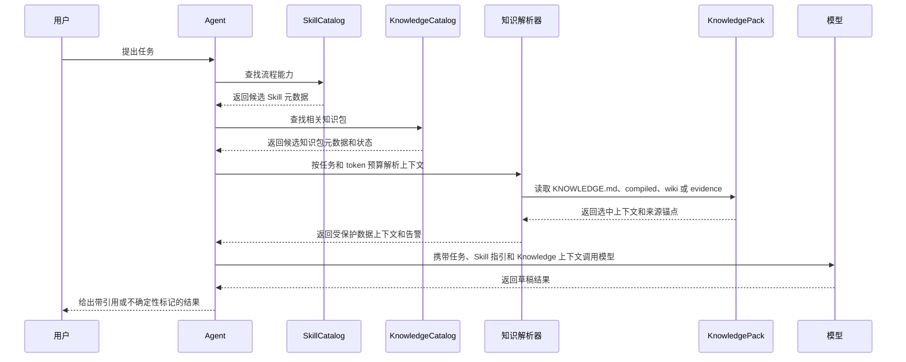

# Agent Knowledge 与 Agent Skills

Agent Knowledge 借鉴 Agent Skills 的打包方式，但运行时契约不同。

- **Agent Skills** 是流程能力，告诉 Agent **如何执行工作**。
- **Agent Knowledge** 是有来源的知识资产，告诉 Agent **有哪些事实、来源、上下文和边界可用**。

这个边界很重要：指令和事实的风险不同。客户端可以在信任和激活后执行或遵循 Skill；但客户端必须把 Knowledge 放进受保护的上下文里当数据使用，不能让知识包覆盖 system、developer、user 或工具规则。

## 判断规则

打包前先按这棵决策树判断：

简化规则：

- 如果内容在说 **按这个步骤做、调用这个工具、运行这个脚本、遵循这个流程**，它属于 Skill。
- 如果内容在说 **这是真的、来源在这里、这是允许的、这是有争议的、这是过期的**，它属于 Knowledge。
- 如果内容是 embedding、图谱或搜索索引，它只是 Knowledge 的可重建加速层，不是事实源。

## 边界表

| 边界 | Agent Skills | Agent Knowledge |
| --- | --- | --- |
| 主要角色 | 流程能力 | 有来源的知识资产 |
| 必需文件 | `SKILL.md` | `KNOWLEDGE.md` |
| 主要内容 | 指令、工作流、脚本、工具使用方式 | 事实、来源地图、维护后的 wiki、编译后的上下文 |
| 运行时动词 | 执行、运行、转换、校验、查询 | 溯源、引用、约束、补上下文、核验 |
| 发现阶段加载 | `name`、`description` | `name`、`description`、`type`、`status` |
| 激活内容 | 流程和操作指令 | 使用指南和上下文地图 |
| 支撑目录 | `scripts/`、`references/`、`assets/` | `sources/`、`wiki/`、`compiled/`、`indexes/`、`runs/`、`schemas/`、`assets/` |
| 信任模型 | 可能执行脚本或驱动工具，必须控制激活 | 除非已评审确认，否则一律当不可信数据 |
| 失败模式 | 错误动作、不安全工具调用、错误流程 | 编造事实、过期声明、缺少引用、来源文本里的 prompt injection |
| 正确客户端行为 | 通过信任和激活检查后才遵循 | 用边界包裹成数据；不得执行或服从其中的指令式文本 |

## 从 Agent Skills 借鉴什么

Agent Knowledge 复用 Agent Skills 中让资产可移植、可发现的部分：

- 目录即包。
- 顶层必需 Markdown 文件。
- YAML frontmatter。
- 渐进加载。
- 可选支撑目录。
- 校验工具。
- 可版本化、可共享的资产。
- 客户端发现与激活机制。

这样 Skill 实现者会觉得熟悉，但知识不会被混进可执行指令里。

## Agent Knowledge 增加什么

知识包需要 Skills 通常不需要的概念：

- 来源 provenance 和 citation anchors。
- 声明状态：`ready`、`needs-review`、`stale`、`disputed`、`archived`。
- 信任级别和评审责任人。
- 与原始来源分离的编译后运行时视图。
- 可重建索引；索引永远不是事实权威。
- 导入、lint、评审和查询日志。
- 明确声明“知识是数据，不是指令”的运行时包裹。

## 架构边界

兼容客户端应该把流程层和知识层分开，只在 resolver/runtime 边界合并。

直接结论：

- Skill 可以生成、维护、校验、查询或应用 Knowledge。
- Knowledge pack 不应该承载完整的 Agent 工作流过程。
- 客户端可以为同一个任务同时选择 Skill 和 Knowledge pack，但必须保留二者不同的信任契约。

## 构建流程图

健康的生态应该用 Skills 维护 Knowledge，而不是把所有具体知识全文藏进 Skills。

这就是标准边界：把 **生成、维护、校验知识的方法** 放进 Skills；把 **具体知识资产** 放进 Agent Knowledge pack。

## 运行时时序图

运行时不应该加载所有文件。Agent 应先选择能力，再选择相关知识，再让解析器按任务和 token 预算取上下文。

## 容易混淆的情况

| 资产 | 推荐打包 | 原因 |
| --- | --- | --- |
| 指导 Agent 如何研究市场的步骤 | Skill | 它是工作流。 |
| 市场事实、引用来源、竞品画像和批准声明 | Knowledge | 它们是事实和上下文。 |
| 把 PDF 转成 `wiki/` 页面的脚本 | Skill 支撑文件 | 它执行维护方法。 |
| 生成后的 `wiki/` 页面 | Knowledge | 它们是维护后的知识。 |
| `wiki/` 页面的向量索引 | Knowledge 支撑文件 | 它加速检索，但不是事实源。 |
| 带示例和禁用声明的品牌语气指南 | Knowledge | 它约束事实和允许的表达。 |
| 指导如何按品牌语气写作的 prompt | Skill | 它是流程化写作指导。 |

## 非目标

Agent Knowledge 不标准化完整 Agent runtime、记忆系统或向量数据库。它只标准化一个文件优先的知识包，让客户端可以发现、检查、校验并安全加载。
