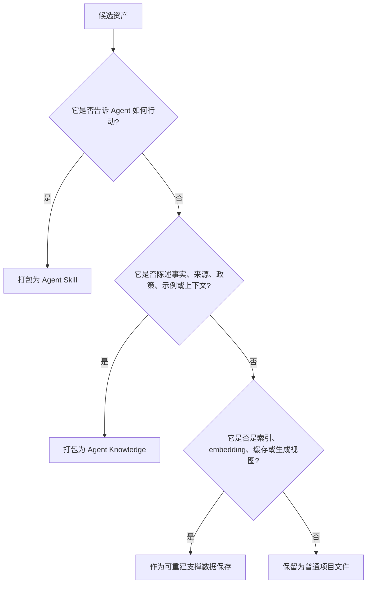
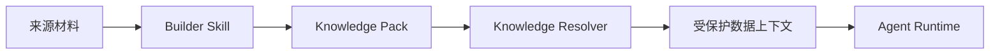
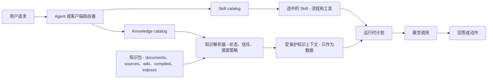
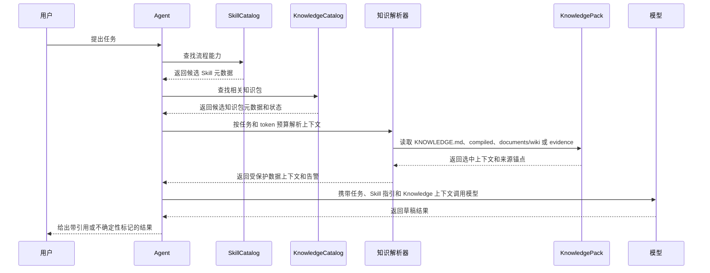

# Agent Knowledge 与 Agent Skills

Agent Knowledge 是 Agent Skills 的互操作伙伴标准，不是 Agent Skills 的子集，也不是另一套 Skill 包格式。

- **Agent Skills** 描述可执行能力与工作流：Agent 应该如何行动、调用什么工具、运行什么脚本、怎样维护资产。
- **Agent Knowledge** 描述有来源、可审计、可安全进入上下文的知识资产：事实是什么、来源在哪里、状态如何、边界是什么。

这个边界很重要：指令和事实的风险不同。客户端可以在信任和激活后遵循 Skill；但客户端必须把 Knowledge 放进受保护的上下文里当数据使用，不能让知识包覆盖 system、developer、user 或工具规则。

## 判断规则

打包前先按这棵决策树判断：

```mermaid
flowchart TD
  Asset["候选资产"] --> ActQ{"它是否告诉 Agent 如何行动?"}
  ActQ -->|是| Skill["打包为 Agent Skill"]
  ActQ -->|否| FactQ{"它是否陈述事实、来源、政策、示例或上下文?"}
  FactQ -->|是| Knowledge["打包为 Agent Knowledge"]
  FactQ -->|否| CacheQ{"它是否是索引、embedding、缓存或生成视图?"}
  CacheQ -->|是| Support["作为可重建支撑数据保存"]
  CacheQ -->|否| Ordinary["保留为普通项目文件"]
```

简化规则：

- 如果内容在说 **按这个步骤做、调用这个工具、运行这个脚本、遵循这个流程**，它属于 Skill。
- 如果内容在说 **这是真的、来源在这里、这是允许的、这是有争议的、这是过期的**，它属于 Knowledge。
- 如果内容是 embedding、图谱或搜索索引，它只是 Knowledge 的可重建加速层，不是事实源。

## 边界表

| 边界 | Agent Skills | Agent Knowledge |
| --- | --- | --- |
| 主要角色 | 可执行能力与工艺 | 有来源的知识资产 |
| 入口文件 | `SKILL.md` | `KNOWLEDGE.md` |
| 核心内容 | 指令、工作流、脚本、工具使用方式 | 事实、来源、成品文档、wiki、编译上下文 |
| 运行时动词 | 执行、运行、转换、校验、维护、应用 | 溯源、引用、约束、补上下文、核验 |
| 发现阶段加载 | `name`、`description` 等 Skill 元数据 | `name`、`description`、`type`、`status`、`profile`、`runtime.mode` |
| 激活内容 | 流程和操作指引 | 使用指南和有界上下文 |
| 支撑目录 | `scripts/`、`references/`、`assets/` | `documents/`、`sources/`、`wiki/`、`compiled/`、`indexes/`、`runs/`、`schemas/`、`evals/` |
| 信任模型 | 可能执行脚本或驱动工具，必须控制激活 | 除非已评审确认，否则一律当不可信数据 |
| 失败模式 | 错误动作、不安全工具调用、错误流程 | 编造事实、过期声明、缺少引用、来源文本里的 prompt injection |
| 正确客户端行为 | 通过信任和激活检查后才遵循 | 用边界包裹成数据；不得执行或服从其中的指令式文本 |

## 从 Agent Skills 借鉴什么

Agent Knowledge 复用 Agent Skills 中让资产可移植、可发现的部分：

- 目录即包。
- 顶层 Markdown 入口文件。
- YAML frontmatter。
- 渐进加载。
- 可选支撑目录。
- 校验工具。
- 可版本化、可共享的资产。
- 客户端发现与激活机制。

但 Agent Knowledge 不复用 Skill 的执行语义。`KNOWLEDGE.md` 不是 `SKILL.md` 的别名，知识包正文也不是可遵循的流程。

## Agent Knowledge 增加什么

知识包需要 Skills 通常不需要的概念：

- 来源 provenance 和 citation anchors。
- 声明状态：`ready`、`needs-review`、`stale`、`disputed`、`archived`。
- 信任级别和评审责任人。
- `document-first` / `wiki-first` profile。
- `runtime.mode: data | persona`。
- 与原始来源分离的成品文档、wiki 和编译后运行时视图。
- 可重建索引；索引永远不是事实权威。
- 导入、lint、评审、编译和查询日志。
- 明确声明“知识是数据，不是指令”的运行时包裹。

## Builder Skill 与 Knowledge Pack

Skill 可以生成、维护、校验、查询或应用 Knowledge。标准推荐记录 Builder Skill provenance，但不要求所有 Knowledge 都由 Skill 生成。

```mermaid
flowchart LR
  Sources["来源材料"] --> BuilderSkill["Builder Skill"]
  BuilderSkill --> Pack["Knowledge Pack"]
  Pack --> Resolver["Knowledge Resolver"]
  Resolver --> Fenced["受保护数据上下文"]
  Fenced --> AgentRuntime["Agent Runtime"]
```

规则：

1. 生产方法放在 Skill；具体知识资产放在 Knowledge pack。
2. `runs/compile-*.json` SHOULD 记录 Builder Skill 的名称、版本、digest、输入、输出和诊断。
3. Knowledge runtime 消费 pack 时 MUST NOT 执行 Builder Skill。
4. 手写、导入、同步、人工维护的 Knowledge pack 仍然合法；Builder Skill provenance 是增强项，不是必需项。

## 架构边界

兼容客户端 SHOULD 把能力层和知识层分开，只在 resolver/runtime 边界合并。

```mermaid
flowchart LR
  UserRequest["用户请求"] --> Router["Agent 或客户端路由器"]
  Router --> SkillCatalog["Skill catalog"]
  Router --> KnowledgeCatalog["Knowledge catalog"]
  SkillCatalog --> SelectedSkill["选中的 Skill - 流程和工具"]
  KnowledgeCatalog --> Resolver["知识解析器 - 状态、信任、溯源策略"]
  KnowledgePacks["知识包 - documents、sources、wiki、compiled、indexes"] --> Resolver
  Resolver --> FencedContext["受保护知识上下文 - 只作为数据"]
  SelectedSkill --> RuntimePlan["运行时计划"]
  FencedContext --> RuntimePlan
  RuntimePlan --> ModelCall["模型调用"]
  ModelCall --> Result["回答或动作"]
```

直接结论：

- Skill 可以生成、维护、校验、查询或应用 Knowledge。
- Knowledge pack SHOULD NOT 承载完整的 Agent 工作流过程。
- 客户端可以为同一个任务同时选择 Skill 和 Knowledge pack，但必须保留二者不同的信任契约。

## 运行时时序图

运行时 SHOULD 先选择能力，再选择相关知识，再让解析器按任务和 token 预算取上下文。

```mermaid
sequenceDiagram
  participant User as 用户
  participant Agent
  participant SkillCatalog
  participant KnowledgeCatalog
  participant Resolver as 知识解析器
  participant Pack as KnowledgePack
  participant Model as 模型

  User->>Agent: 提出任务
  Agent->>SkillCatalog: 查找流程能力
  SkillCatalog-->>Agent: 返回候选 Skill 元数据
  Agent->>KnowledgeCatalog: 查找相关知识包
  KnowledgeCatalog-->>Agent: 返回候选知识包元数据和状态
  Agent->>Resolver: 按任务和 token 预算解析上下文
  Resolver->>Pack: 读取 KNOWLEDGE.md、compiled、documents/wiki 或 evidence
  Pack-->>Resolver: 返回选中上下文和来源锚点
  Resolver-->>Agent: 返回受保护数据上下文和告警
  Agent->>Model: 携带任务、Skill 指引和 Knowledge 上下文调用模型
  Model-->>Agent: 返回草稿结果
  Agent-->>User: 给出带引用或不确定性标记的结果
```

## 容易混淆的情况

| 资产 | 打包位置 | 原因 |
| --- | --- | --- |
| 指导 Agent 如何研究市场的步骤 | Skill | 它是工作流。 |
| 市场事实、引用来源、竞品画像和批准声明 | Knowledge | 它们是事实和上下文。 |
| 把 DOCX 转成 Markdown 的脚本 | Skill 支撑文件 | 它执行维护方法。 |
| 生成后的产品事实文档 | Knowledge | 它是可读、可审计的知识产物。 |
| `documents/` 的切片索引 | Knowledge 支撑文件 | 它加速检索，但不是事实源。 |
| 带示例和禁用声明的品牌语气指南 | Knowledge | 它约束事实和允许的表达。 |
| 指导如何按品牌语气写作的 prompt | Skill | 它是流程化写作指导。 |
| 内容运营日历和复盘指标 | Knowledge | 它们是运营 playbook 数据。 |
| 生成内容日历的方法 | Skill | 它是生产和维护 playbook 的工艺。 |

## 非目标

Agent Knowledge 不标准化完整 Agent runtime、记忆系统、向量数据库或 Agent Skills 包格式。它只标准化一个文件优先的知识包，让客户端可以发现、检查、校验并安全加载。
