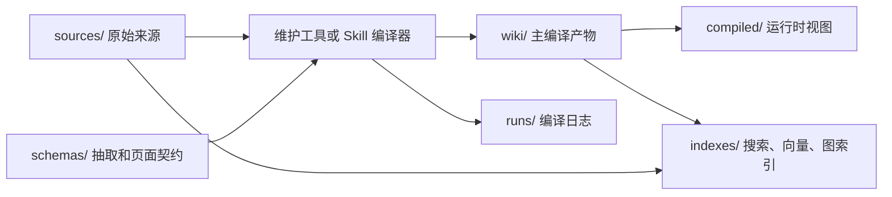
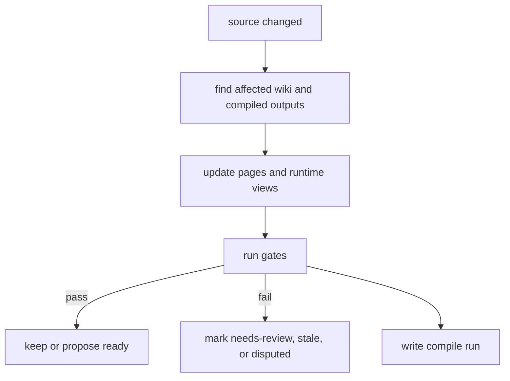

# 编译模型

Agent Knowledge 的核心不是把原始文档切块后等待查询时临时综合，而是把来源资料持续编译成可维护、可审计、可复用的知识工件。

在这个模型里，`wiki/` 是主编译产物，`compiled/` 是面向运行时的派生视图，`indexes/` 是可重建的检索加速层，`runs/` 是编译日志和审计证据。

如果你想先从使用流程理解它，可以先看 [知识库工程闭环](/zh/authoring/knowledge-engineering-loop)。



## 编译什么

编译器可以是 Agent Skill、客户端命令、CI 工具或外部脚本。它读取经过选择的来源，并产出或更新：

- 来源摘要。
- 实体、概念、决策、开放问题和矛盾页面。
- 跨来源综合页。
- claim 的来源锚点和状态。
- 面向运行时的紧凑 briefing、facts、boundaries。
- 全文、向量或图索引。
- 编译运行记录。

## 目录职责

| 目录 | 编译角色 | 是否权威 |
| --- | --- | --- |
| `sources/` | 输入。保存原始或规范化证据。 | 是，作为原始证据。 |
| `wiki/` | 主编译产物。保存长期维护的知识中间表示。 | 是，作为被维护知识。 |
| `compiled/` | 派生运行时视图。压缩 `wiki/` 中常用上下文。 | 有条件，必须能追溯到 `wiki/` 或 `sources/`。 |
| `indexes/` | 派生检索结构。帮助找候选页面或片段。 | 否，只能加速检索。 |
| `runs/` | 编译、lint、review、eval 的审计记录。 | 否，是证据和诊断。 |
| `schemas/` | 编译输入和输出的结构契约。 | 是，作为校验契约。 |

## 编译产物和运行时视图

`compiled/` 这个名字容易被误解。它不是所有编译结果的唯一位置。

- `wiki/` 是主要编译产物：它保留结构、链接、矛盾、开放问题和来源关系。
- `compiled/` 是运行时优化产物：它把常用知识压缩成短上下文，供 resolver 优先加载。
- `indexes/` 是机器加速产物：它必须能从 `sources/`、`wiki/` 和 `compiled/` 重建。

因此，常规回答可以优先加载 `compiled/`，但维护、核验、争议处理和多跳综合应回到 `wiki/` 和 `sources/`。

## Source map

重要 claim 应保留来源映射。最小做法是在 Markdown 中使用来源锚点：

```markdown
- Acme Widget 支持离线队列。 [source: sources/reports/q1.md#L42]
```

高风险或大规模知识包应使用结构化 claim：

```yaml
claim_id: clm-acme-offline-queue
text: Acme Widget 支持离线队列。
status: confirmed
source:
  path: sources/reports/q1.md
  anchor: L42
compiled_into:
  - wiki/concepts/offline-queue.md
  - compiled/facts.md
```

当 `grounding: required` 时，编译器不得把没有来源锚点的重要 claim 写入 `ready` 产物；它应写入 `wiki/open-questions/`，或把 claim 标为 `missing`、`inferred`、`source-required`。

## 增量编译

知识包应支持增量更新，而不是每次重建整本 wiki。

当来源变化时，维护工具应计算受影响集合：

1. 读取变化的 `sources/` 文件和已有 source map。
2. 找出依赖该来源的 `wiki/` 页面和 `compiled/` 视图。
3. 更新相关页面、矛盾记录、开放问题和索引。
4. 将受影响路径、变更类型和诊断写入 `runs/`。
5. 如果输出未通过门禁，将 pack 或相关页面标记为 `needs-review`、`stale` 或 `disputed`。



## 编译门禁

写入 `wiki/` 或 `compiled/` 前，维护工具应至少检查：

- 重要 claim 有来源锚点。
- 新 claim 不与已有 ready claim 冲突，或冲突被写入 `wiki/contradictions/`。
- `compiled/` 没有直接复制大段原始来源。
- 过期来源不会静默覆盖更新来源。
- 来源中明显的 prompt injection 不会变成运行时指令。
- 可能包含 secret 或敏感信息的内容被标记或阻止。
- 输出文件与声明的 schema 兼容。

## 编译运行记录

推荐把编译运行写入 `runs/compile-<timestamp>.json`：

```json
{
  "run_id": "compile-2026-05-01T10-30-00Z",
  "trigger": "ingest",
  "status": "needs-review",
  "compiler": {
    "tool": "agent-knowledge-compiler",
    "version": "0.3.0",
    "model": "gpt-5.4"
  },
  "inputs": [
    {
      "path": "sources/reports/q1.md",
      "sha256": "..."
    }
  ],
  "outputs": [
    {
      "path": "wiki/concepts/offline-queue.md",
      "operation": "updated"
    },
    {
      "path": "compiled/facts.md",
      "operation": "updated"
    }
  ],
  "diagnostics": [
    {
      "severity": "warning",
      "path": "wiki/open-questions/pricing.md",
      "message": "价格信息缺少官方来源。"
    }
  ],
  "review": {
    "required": true,
    "reason": "新增产品能力 claim"
  }
}
```

`runs/` 不是事实权威；它让维护者和客户端解释为什么某些页面被更新、为什么某些 claim 不能进入 ready 状态。

## Resolver 如何使用编译产物

运行时 resolver 应遵循：

1. 先读取 `KNOWLEDGE.md` 的上下文地图。
2. 普通任务优先读取 `compiled/`。
3. 多跳、争议、细节或新问题读取相关 `wiki/` 页面。
4. 需要引用或核验时读取 `sources/` 锚点。
5. 使用 `indexes/` 只找候选，不把 index hit 当事实。
6. 如果 `compiled/` 的 source map 指向 stale 或 disputed 页面，返回告警。

## 非目标

Agent Knowledge 不规定某个具体编译器、向量库、图数据库或模型。标准规定的是可移植工件边界和审计契约：输入是什么，产物是什么，如何追溯，如何判断输出是否可信。
