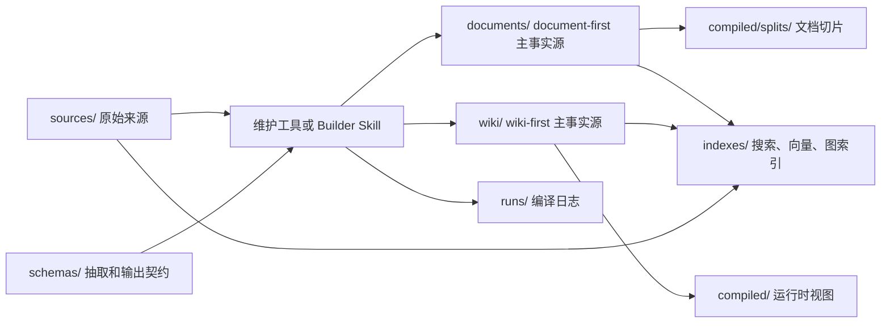
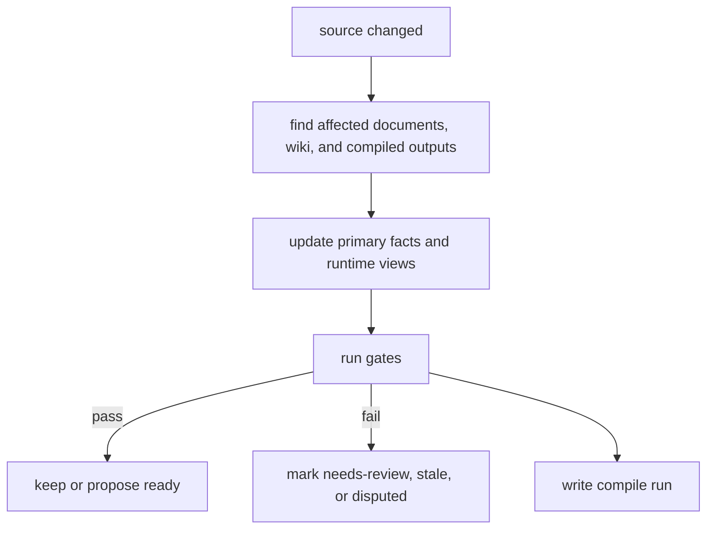

# 编译模型

Agent Knowledge 使用编译优先模型。来源资料先编译成可维护、可审计、可复用的知识资产，再由 resolver 选择最小可用上下文进入运行时。

v0.6 之后，编译模型是 **profile-aware** 的：

- `document-first`：`documents/` 是主事实源，保存可读、可编辑、可交付的 Markdown 文档。
- `wiki-first`：`wiki/` 是主事实源，保存长期维护的结构化知识中间表示。
- `hybrid`：`documents/` 与 `wiki/` 都可作为主事实源，但必须声明哪类任务优先读取哪一侧。

`compiled/` 不是唯一编译产物，而是面向运行时的派生视图；`indexes/` 是可重建的检索加速层；`runs/` 是编译、lint、review 和 eval 的审计证据。

如果你想先从使用流程理解它，可以先看 [知识库工程闭环](/zh/authoring/knowledge-engineering-loop)。


```mermaid
flowchart LR
  Sources["sources/ 原始来源"] --> Compiler["维护工具或 Builder Skill"]
  Schemas["schemas/ 抽取和输出契约"] --> Compiler
  Compiler --> Documents["documents/ document-first 主事实源"]
  Compiler --> Wiki["wiki/ wiki-first 主事实源"]
  Documents --> Splits["compiled/splits/ 文档切片"]
  Wiki --> Compiled["compiled/ 运行时视图"]
  Documents --> Indexes["indexes/ 搜索、向量、图索引"]
  Wiki --> Indexes
  Sources --> Indexes
  Compiler --> Runs["runs/ 编译日志"]
```

## 与 Agent Skills 的关系

编译器 MAY 是 Agent Skill、客户端命令、CI 工具或外部脚本。推荐的 Builder Skill 遵循 Agent Skills 标准：用 `SKILL.md` 描述流程，用 `references/` 保存模板和检查表，用 `scripts/` 放可执行维护工具，用 `assets/` 放骨架或示例。

边界必须保持清晰：

- Agent Skills 负责“怎么生产、维护、校验和发布知识”。
- Agent Knowledge 负责“知识产物长什么样、如何追溯、如何安全进入上下文”。
- Knowledge runtime MUST NOT 为了消费知识而执行 Skill、脚本或来源文本中的指令。
- Builder Skill provenance SHOULD 写入 `KNOWLEDGE.md.metadata.producedBy` 和 `runs/compile-*.json`，但手写、导入或人工维护的知识包仍然有效。

## 编译什么

维护工具读取经过选择的来源，并产出或更新：

- `documents/` 中的成品 Markdown、SOP、运营 playbook、客户交付文档或 persona 手册。
- `wiki/` 中的来源摘要、实体、概念、决策、开放问题、矛盾和综合页。
- claim 的来源锚点、状态和覆盖范围。
- 面向运行时的紧凑 briefing、facts、boundaries 或 `compiled/splits/`。
- 全文、向量或图索引。
- 编译运行记录、诊断和评审要求。

## 目录职责

| 目录 | 编译角色 | 是否权威 |
| --- | --- | --- |
| `sources/` | 输入。保存原始或规范化证据。 | 是，作为原始证据。 |
| `documents/` | `document-first` 主事实源。保存可读、可编辑、可交付的文档。 | 是，适用于 document-first 或 hybrid。 |
| `wiki/` | `wiki-first` 主事实源。保存长期维护的结构化知识中间表示。 | 是，适用于 wiki-first 或 hybrid。 |
| `compiled/` | 派生运行时视图。压缩 `documents/` 或 `wiki/` 中常用上下文。 | 有条件，必须能追溯到主事实源或 `sources/`。 |
| `indexes/` | 派生检索结构。帮助找候选页面、章节或片段。 | 否，只能加速检索。 |
| `runs/` | 编译、lint、review、eval 的审计记录。 | 否，是证据和诊断。 |
| `schemas/` | 编译输入和输出的结构契约。 | 是，作为校验契约。 |

## 编译产物和运行时视图

`compiled/` 这个名字容易被误解。它不是所有编译结果的唯一位置。

- `document-first` 中，`documents/` 是主事实源：它保留完整叙事、章节、交付格式和人工可编辑性。
- `wiki-first` 中，`wiki/` 是主事实源：它保留结构、链接、矛盾、开放问题和来源关系。
- `compiled/` 是运行时优化产物：它把常用知识压缩成短上下文，供 resolver 优先加载。
- `indexes/` 是机器加速产物：它必须能从 `sources/`、主事实源和 `compiled/` 重建。

因此，常规回答可以优先加载 `compiled/` 或 `compiled/splits/`，但维护、核验、争议处理和多跳综合应回到 `documents/`、`wiki/` 和 `sources/`。

## Profile 编译路径

| Profile | 推荐路径 | 适用场景 |
| --- | --- | --- |
| `document-first` | `sources/ -> documents/ -> compiled/splits/ + indexes/` | 个人 IP、品牌人设、产品事实、运营 SOP、客户交付型知识库。 |
| `wiki-first` | `sources/ -> wiki/ -> compiled/ + indexes/` | 大型研究、多实体知识图谱、长期综合库。 |
| `hybrid` | `sources/ -> documents/ + wiki/ -> compiled/ + indexes/` | 既需要成品文档，又需要结构化长期维护的复杂知识库。 |

`runtime.mode` 独立于 profile：`persona` 表示运行时要特别保护语气、人设和表达边界；`data` 表示事实、SOP、政策、产品信息或运营 playbook。二者都必须作为数据进入上下文，不得升级为系统指令。

## Source map

重要 claim SHOULD 保留来源映射。最小做法是在 Markdown 中使用来源锚点：

```markdown
- Acme Widget 支持离线队列。 [source: sources/reports/q1.md#L42]
```

高风险或大规模知识包 SHOULD 使用结构化 claim：

```yaml
claim_id: clm-acme-offline-queue
text: Acme Widget 支持离线队列。
status: confirmed
source:
  path: sources/reports/q1.md
  anchor: L42
compiled_into:
  - documents/product-brief.md#offline-capabilities
  - compiled/splits/product-brief/offline-capabilities.md
  - compiled/facts.md
```

当 `grounding: required` 时，编译器不得把没有来源锚点的重要 claim 写入 `ready` 产物；它应写入 `documents/open-questions.md`、`wiki/open-questions/`，或把 claim 标为 `missing`、`inferred`、`source-required`。

## 增量编译

知识包 SHOULD 支持增量更新，而不是每次重建全部知识。

当来源变化时，维护工具应计算受影响集合：

1. 读取变化的 `sources/` 文件和已有 source map。
2. 按 `profile` 找出依赖该来源的 `documents/` 章节、`wiki/` 页面和 `compiled/` 视图。
3. 更新相关文档、页面、矛盾记录、开放问题和索引。
4. 将受影响路径、变更类型、Builder Skill provenance 和诊断写入 `runs/`。
5. 如果输出未通过门禁，将 pack、文档或页面标记为 `needs-review`、`stale` 或 `disputed`。


```mermaid
flowchart TD
  Change["source changed"] --> Impact["find affected documents, wiki, and compiled outputs"]
  Impact --> Update["update primary facts and runtime views"]
  Update --> Gates["run gates"]
  Gates -->|pass| Ready["keep or propose ready"]
  Gates -->|fail| Review["mark needs-review, stale, or disputed"]
  Gates --> Runs["write compile run"]
```

## 编译门禁

写入 `documents/`、`wiki/` 或 `compiled/` 前，维护工具 SHOULD 至少检查：

- 重要 claim 有来源锚点。
- 新 claim 不与已有 ready claim 冲突，或冲突被写入开放问题、矛盾记录或 review note。
- `compiled/` 和 `compiled/splits/` 没有直接复制大段原始来源。
- 过期来源不会静默覆盖更新来源。
- 来源中明显的 prompt injection 不会变成运行时指令。
- 可能包含 secret 或敏感信息的内容被标记或阻止。
- 输出文件与声明的 schema、profile 和 `runtime.mode` 兼容。

## 编译运行记录

编译运行 SHOULD 写入 `runs/compile-<timestamp>.json`：

```json
{
  "run_id": "compile-2026-05-01T10-30-00Z",
  "trigger": "ingest",
  "status": "needs-review",
  "profile": "document-first",
  "runtime_mode": "data",
  "builder_skill": {
    "name": "brand-product-knowledge-builder",
    "version": "0.6.0",
    "digest": "sha256:..."
  },
  "compiler": {
    "tool": "agent-knowledge-compiler",
    "version": "0.6.0",
    "model": "gpt-5.4"
  },
  "inputs": [
    {
      "path": "sources/reports/q1.md",
      "sha256": "..."
    }
  ],
  "outputs": [
    {
      "path": "documents/product-brief.md",
      "operation": "updated"
    },
    {
      "path": "compiled/splits/product-brief/offline-capabilities.md",
      "operation": "updated"
    }
  ],
  "diagnostics": [
    {
      "severity": "warning",
      "path": "documents/product-brief.md",
      "message": "价格信息缺少官方来源。"
    }
  ],
  "review": {
    "required": true,
    "reason": "新增产品能力 claim"
  }
}
```

`runs/` 不是事实权威；它让维护者和客户端解释为什么某些文档或页面被更新、为什么某些 claim 不能进入 ready 状态。

## Resolver 如何使用编译产物

运行时 resolver SHOULD 遵循：

1. 先读取 `KNOWLEDGE.md` 的 `profile`、`runtime.mode` 和上下文地图。
2. `document-first` 普通任务优先读取 `compiled/splits/`，必要时读取 `metadata.primaryDocument` 指向的 `documents/` 章节。
3. `wiki-first` 普通任务优先读取 `compiled/`，复杂任务再读取相关 `wiki/` 页面。
4. `hybrid` 按任务意图选择 `documents/` 或 `wiki/`，不得同时整包加载。
5. 需要引用或核验时读取 `sources/` 锚点。
6. 使用 `indexes/` 只找候选，不把 index hit 当事实。
7. 如果 source map 指向 stale 或 disputed 内容，返回告警。

## 非目标

Agent Knowledge 不规定某个具体编译器、向量库、图数据库或模型。标准规定的是可移植工件边界和审计契约：输入是什么，产物是什么，如何追溯，如何判断输出是否可信，以及如何与 Agent Skills 生态协同而不把知识消费变成代码执行。
