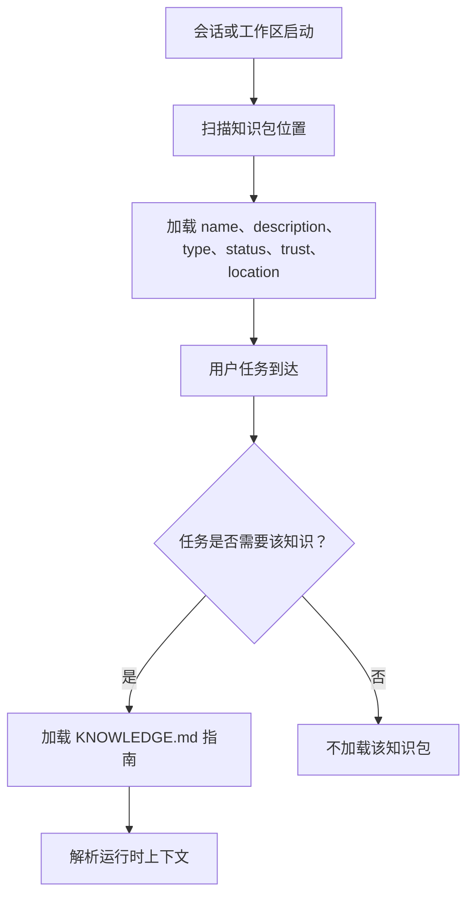
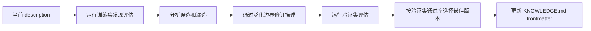

# 描述与发现

Agent Knowledge 借鉴 Agent Skills 的渐进加载思想：客户端先看到紧凑元数据，只在任务需要时再加载完整知识包。

因此 `description` 是高价值字段。它不是营销文案，而是帮助 Agent 判断是否需要该知识包的发现契约。

## 发现机制



描述太弱会导致漏选；描述过宽会导致误选，加载无关甚至有风险的知识。

## 描述规则

好的知识包描述应说明：

- 包里有哪些知识。
- Agent 应该在什么场景使用。
- 覆盖哪些用户意图或领域。
- 重要边界和近似但不适用的场景。
- 是否需要溯源、引用或评审状态。

好的例子：

```yaml
description: Acme Widget 的产品事实、批准定位、价格边界、客服语言和有来源声明。用于撰写 Acme 营销文案、销售回复、客服答案、合作伙伴简报，或检查 Acme 相关 claim 是否已批准。
```

差的例子：

```yaml
description: Acme 知识。
```

## 保持紧凑

`description` 最多 1024 字符。它会进入 catalog，多个知识包同时存在时不能膨胀上下文。

不要把完整指令、来源摘录或长分类放进 `description`。这些内容应放进 `KNOWLEDGE.md`、`compiled/` 或 `wiki/`。

## 发现评估

借鉴 Agent Skills 的 trigger eval，把它改成知识选择评估。

可选创建 `evals/discovery.json`：

```json
{
  "pack_name": "acme-product-brief",
  "queries": [
    {
      "query": "帮我写一封 Acme Widget 合作伙伴发布邮件，但不要编价格。",
      "should_select": true
    },
    {
      "query": "解释一下移动 App 里 OAuth PKCE 怎么实现。",
      "should_select": false
    }
  ]
}
```

严肃知识包建议约 20 条查询：8-10 条应选择，8-10 条不应选择。

## 正例查询

正例应覆盖：

- 显式提及："使用 Acme 产品知识包"。
- 隐式意图："写一段 Acme 保修客服回复"。
- 口语、缩写和少量拼写错误。
- 简短任务和多步骤长任务。
- 知识包有帮助，但关键词不明显的任务。

## 负例查询

最有价值的负例是近似但不适用的任务。它们与知识包共享关键词，但不应该加载。

对品牌/产品包，强负例包括：

- 提到产品名但实际需要代码上下文的工程任务。
- 不需要批准品牌事实的泛商务写作。
- 不应把 Acme 声明当事实的竞品研究。
- 超出知识包评审范围的法律或合规建议。

## 训练集与验证集

不要用全部查询调 description。拆成：

- `evals/discovery.train.json`：用于迭代。
- `evals/discovery.validation.json`：用于泛化检查。

用训练集找失败，用验证集选择最好版本，减少对固定措辞的过拟合。

## 优化循环



漏选通常说明描述太窄；误选通常说明描述太宽或边界不清。

不要机械添加失败查询里的原词，要抽象出它代表的通用类别。

## 记录什么

发现评估结果写入 `runs/`：

```text
runs/
└── discovery-eval-2026-05-01.json
```

推荐字段：

```json
{
  "pack_name": "acme-product-brief",
  "description_hash": "sha256:...",
  "runs_per_query": 3,
  "threshold": 0.5,
  "summary": {
    "true_positive": 9,
    "false_negative": 1,
    "true_negative": 8,
    "false_positive": 2,
    "pass_rate": 0.85
  }
}
```

模型行为可能波动。条件允许时，每条查询运行多次并计算选择率。
