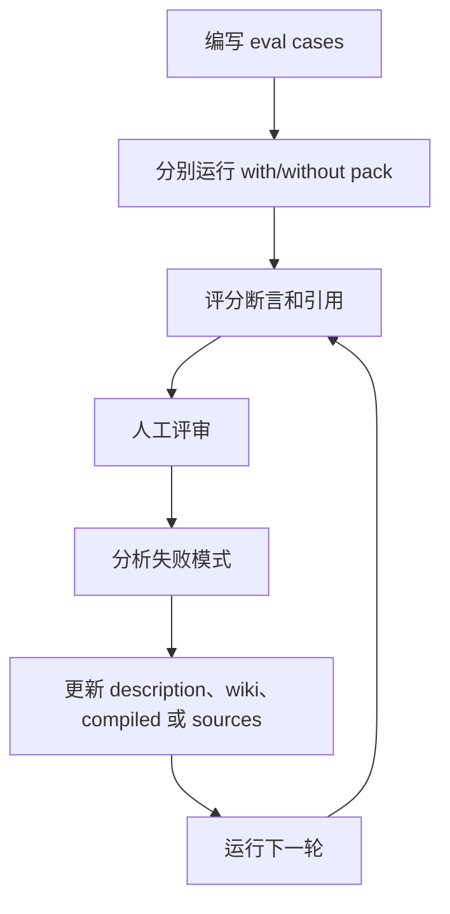

# 评估知识包

知识包在一次手工测试中看起来正确，并不代表生产可用。评估给维护者一个可重复循环，用来改进 description、溯源、运行时上下文和回答质量。

Agent Knowledge 借鉴 Agent Skills 的 eval-driven iteration，但评估目标不同：判断知识包是否被正确选择、选中的上下文是否有来源、最终回答是否遵守 claim 和边界。

## 评估什么

| 层级 | 问题 | 示例指标 |
| --- | --- | --- |
| 发现 | 客户端是否在正确任务选择该知识包？ | selection pass rate |
| 上下文解析 | resolver 是否加载正确的 `compiled/`、`wiki/` 和证据文件？ | required-section recall |
| 溯源 | 要求引用时，回答 claim 是否有来源支撑？ | citation coverage |
| 边界遵守 | Agent 是否避免禁用或未知 claim？ | boundary violation count |
| 新鲜度 | stale/disputed 知识是否触发告警？ | status-warning accuracy |
| 输出质量 | 最终回答是否满足用户意图？ | assertion pass rate 和人工评审 |

## 推荐结构

`evals/` 放人工编写的测试用例，`runs/` 放生成结果。

```text
acme-product-brief/
├── KNOWLEDGE.md
├── evals/
│   ├── discovery.train.json
│   ├── discovery.validation.json
│   ├── answer-quality.json
│   └── files/
├── runs/
│   └── eval-2026-05-01/
│       ├── discovery-results.json
│       ├── answer-results.json
│       ├── benchmark.json
│       └── feedback.json
└── compiled/
```

## 测试用例格式

回答质量评估示例：

```json
{
  "pack_name": "acme-product-brief",
  "evals": [
    {
      "id": "partner-launch-email",
      "prompt": "为 Acme Widget 写一封合作伙伴发布邮件，不要编价格。",
      "expected_output": "使用批准定位、没有编造价格、事实 claim 带引用的发布邮件。",
      "required_context": [
        "compiled/facts.md",
        "compiled/boundaries.md"
      ],
      "assertions": [
        "除非存在有来源价格，否则回答不包含价格。",
        "回答使用已批准的一句话定位。",
        "每个产品能力 claim 都有引用，或被标记为 unknown。"
      ]
    }
  ]
}
```

## 基线

每个 eval 至少跑两组：

- 使用该知识包。
- 不使用知识包，或使用上一版知识包。

对知识包修订，应快照上一版并比较 `old_pack` 与 `new_pack`。目标不只是高分，而是说明知识包改善了什么，以及付出了多少时间、token 和复杂度成本。

## 记录运行

每次运行记录：

```json
{
  "eval_id": "partner-launch-email",
  "configuration": "with_pack",
  "pack_version": "0.2.0",
  "selected_files": ["KNOWLEDGE.md", "compiled/facts.md", "compiled/boundaries.md"],
  "citation_gaps": [],
  "boundary_warnings": [],
  "total_tokens": 4200,
  "duration_ms": 18000
}
```

## 断言

好的断言具体且可检查：

- "回答没有无来源价格 claim。"
- "resolver 加载了 `compiled/boundaries.md`。"
- "每个合规相关 claim 都有来源锚点。"
- "保修时长缺失时，回答明确 unknown。"

弱断言过于模糊或脆弱：

- "回答很好。"
- "回答必须逐字使用这句话。"

机械检查用脚本，语义检查用 LLM judge。每个 pass/fail 都必须给出具体证据。

## 评分输出

```json
{
  "assertion_results": [
    {
      "text": "回答没有无来源价格 claim。",
      "passed": true,
      "evidence": "输出中没有货币金额或价格术语。"
    },
    {
      "text": "每个产品能力 claim 都有引用，或被标记为 unknown。",
      "passed": false,
      "evidence": "'几分钟内部署' 这一 claim 没有来源锚点。"
    }
  ],
  "summary": {
    "passed": 1,
    "failed": 1,
    "total": 2,
    "pass_rate": 0.5
  }
}
```

## Benchmark

每轮聚合：

```json
{
  "run_summary": {
    "with_pack": {
      "pass_rate": { "mean": 0.86 },
      "citation_coverage": { "mean": 0.92 },
      "tokens": { "mean": 3900 }
    },
    "without_pack": {
      "pass_rate": { "mean": 0.42 },
      "citation_coverage": { "mean": 0.15 },
      "tokens": { "mean": 2300 }
    },
    "delta": {
      "pass_rate": 0.44,
      "citation_coverage": 0.77,
      "tokens": 1600
    }
  }
}
```

## 人工评审

断言只能检查你预先想到的问题。人工评审能发现缺失细节、语气问题、误导性综合，以及技术正确但没帮助的回答。

把评审反馈记录到 `runs/<iteration>/feedback.json`，并结合失败断言和执行日志改进下一版。

## 迭代循环



当通过率、引用覆盖率和评审反馈达到该知识包风险等级要求时停止。
