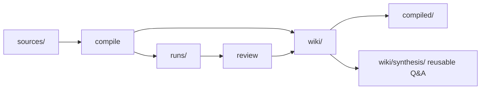

# 知识库工程闭环

很多知识库的问题不是没有内容，而是内容会腐烂：来源越攒越多，摘要散落各处，概念重复定义，问答留在聊天记录里，几个月后很难判断哪条信息还能相信。

Agent Knowledge 借鉴 LLM Wiki 的做法：把知识库当成一个持续编译的工程系统。人负责选择来源和评审关键结果，Agent 或工具负责重复的整理、链接、检查和归档。

## 工程类比

| 软件工程 | Agent Knowledge | 说明 |
| --- | --- | --- |
| `src/` | `sources/` | 原始输入和证据。可以来自网页、会议记录、论文、访谈或内部文档。 |
| `build/` | `wiki/` 和 `compiled/` | `wiki/` 是主编译产物，`compiled/` 是运行时派生视图。 |
| build logs | `runs/` | 编译、lint、review、eval、health check 的记录。 |
| 编译器 | Agent Skill、客户端工具、CI 或脚本 | 读取来源，更新 wiki、compiled 和 indexes。 |
| IDE | 任意编辑器或客户端 | 可以是 Obsidian，也可以是普通文件系统、网页端或桌面客户端。 |
| Lint / CI | 健康检查和 evals | 检查缺来源、矛盾、孤岛、过期 claim 和注入风险。 |

个人实践里常见的 `raw/` 可以映射为 `sources/`，`outputs/` 可以映射为 `runs/`、`wiki/synthesis/` 或 `compiled/`。标准不要求这些别名，也不要求特定编辑器。

## 最小闭环

一个可持续的知识包至少跑通四步：

1. **摄取来源**：把原始材料放进 `sources/`，保留来源 URL、作者、发布时间、采集时间和许可信息。
2. **编译知识**：把来源增量编译成 `wiki/` 页面，例如来源摘要、概念页、实体页、开放问题和矛盾页。
3. **派生运行时视图**：从 `wiki/` 生成短小的 `compiled/` 文件，例如 `facts.md`、`briefing.md`、`boundaries.md`。
4. **检查和沉淀**：把 lint、health check、eval 和有价值的问答结果写回知识包。



## 问答如何变成库存

一次复杂问答如果只留在聊天记录里，通常等于丢失。Agent Knowledge 推荐把有复用价值的回答文件化，但不能把所有输出都无条件写成事实。

推荐规则：

- 临时诊断、编译日志、健康报告写入 `runs/`。
- 有复用价值、带来源、可被未来任务引用的综合结论写入 `wiki/synthesis/`。
- 经常需要加载的短结论再派生成 `compiled/`。
- 未确认、缺来源或有争议的回答必须标记状态，不能进入 `ready` 运行时视图。

示例：

```markdown
---
question: RAG 和轻量索引的适用边界是什么？
asked_at: 2026-05-01
status: needs-review
sources:
  - sources/articles/local-indexing.md#L12
  - wiki/concepts/rag.md
---

# RAG 和轻量索引

## TL;DR

中小规模知识包优先维护 `wiki/index.md`、全文索引和明确的 source map。只有当规模、语义检索需求或召回质量要求超过轻量索引能力时，再引入向量检索。

## 证据

- ...

## 不确定性

- 缺少超过一万条笔记规模下的本地 benchmark。
```

## 健康检查

健康检查不是装饰功能，它是让知识包长期可信的最低成本维护方式。

建议定期检查：

- **一致性**：同一概念是否有冲突定义。
- **完整性**：重要页面是否缺定义、缺例子、缺来源。
- **孤岛**：页面是否缺少入链或出链。
- **新鲜度**：来源或 claim 是否过期。
- **可追溯性**：重要 claim 是否能追到 `sources/`。
- **安全性**：来源中是否有 prompt injection、secret 或敏感内容。

健康检查结果应写入 `runs/health-<date>.json` 或 `runs/health-<date>.md`。如果检查发现严重问题，维护工具应建议把 pack 标为 `needs-review`、`stale` 或 `disputed`。

## 不要过早上 RAG

Agent Knowledge 不排斥 RAG，但不要把向量数据库当成第一步。

小规模知识包优先使用：

- `wiki/index.md`
- `wiki/concepts/`
- `wiki/sources/`
- 轻量全文搜索
- source map

当知识包规模、召回难度或多语言语义检索需求明显超过这些机制时，再把 `indexes/vector/` 作为可重建加速层加入。向量索引仍然不是事实权威。

## 两周试点

第一周跑通 `sources/ -> wiki/`：

- 创建一个小知识包。
- 放入 5 到 10 个高质量来源。
- 编译来源摘要、概念页和索引。
- 记录第一次 `runs/compile-...json`。

第二周跑通沉淀和检查：

- 把复杂问答写入 `wiki/synthesis/`，并标注来源和状态。
- 生成第一次健康检查报告。
- 根据报告修复缺来源、孤岛页面和冲突 claim。
- 只在评审后把短结论派生到 `compiled/`。

目标不是马上建大系统，而是让知识包形成持续循环：摄取、编译、使用、沉淀、检查。
