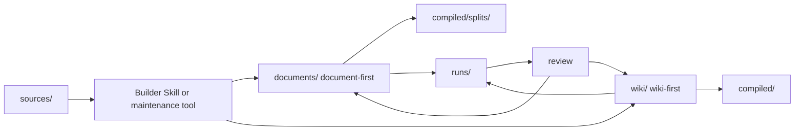

# 知识库工程闭环

把知识包当成持续编译的系统。人负责选择来源和评审关键结果，Builder Skill 或维护工具负责整理、链接、检查和归档。

v0.6 的闭环不再假设所有知识都先进入 `wiki/`。先选择 profile，再决定主事实源：

- `document-first`：先形成 `documents/`，再派生 `compiled/splits/`。
- `wiki-first`：先形成 `wiki/`，再派生 `compiled/`。
- `hybrid`：同时维护 `documents/` 和 `wiki/`，但必须有清晰的任务边界。

## 工程类比

| 软件工程 | Agent Knowledge | 说明 |
| --- | --- | --- |
| `src/` | `sources/` | 原始输入和证据。可以来自网页、会议记录、论文、访谈或内部文档。 |
| `build/` | `documents/`、`wiki/` 和 `compiled/` | `documents/` 或 `wiki/` 是 profile 决定的主事实源，`compiled/` 是运行时派生视图。 |
| build logs | `runs/` | 编译、lint、review、eval、health check 的记录。 |
| 编译器 | Builder Skill、客户端工具、CI 或脚本 | 读取来源，更新主事实源、compiled 和 indexes。 |
| IDE | 任意编辑器或客户端 | 可以是 Obsidian，也可以是普通文件系统、网页端或桌面客户端。 |
| Lint / CI | 健康检查和 evals | 检查缺来源、矛盾、孤岛、过期 claim 和注入风险。 |

个人实践里常见的 `raw/` 可以映射为 `sources/`，`outputs/` 可以映射为 `runs/`、`documents/`、`wiki/synthesis/` 或 `compiled/`。标准不要求这些别名，也不要求特定编辑器。

## 最小闭环

可维护知识包 SHOULD 跑通四步：

1. **摄取来源**：把原始材料放进 `sources/`，保留来源 URL、作者、发布时间、采集时间和许可信息。
2. **编译主事实源**：按 `profile` 编译到 `documents/` 或 `wiki/`。
3. **派生运行时视图**：从主事实源生成短小的 `compiled/` 文件或 `compiled/splits/`。
4. **检查和沉淀**：把 lint、health check、eval 和有价值的问答结果写回知识包。


```mermaid
flowchart LR
  Sources["sources/"] --> Compile["Builder Skill or maintenance tool"]
  Compile --> Documents["documents/ document-first"]
  Compile --> Wiki["wiki/ wiki-first"]
  Documents --> Splits["compiled/splits/"]
  Wiki --> Compiled["compiled/"]
  Documents --> Runs["runs/"]
  Wiki --> Runs
  Runs --> Review["review"]
  Review --> Documents
  Review --> Wiki
```

## Profile 决策

| Profile | 先维护什么 | 常见知识库 |
| --- | --- | --- |
| `document-first` | 一份或多份完整 Markdown 文档。 | 个人 IP、品牌人设、品牌产品、内容运营、私域运营、SOP、客户交付。 |
| `wiki-first` | 结构化页面、实体、概念、来源摘要和综合关系。 | 大型研究、多实体知识图谱、组织 know-how、长期研究库。 |
| `hybrid` | 成品文档 + 结构化 wiki。 | 既对外交付文档，又需要长期多跳维护的大型知识库。 |

选择 `document-first` 不代表放弃结构化；它仍可有 `indexes/`、source map 和 `compiled/splits/`。选择 `wiki-first` 也不代表不能产出文档；成品文档可以作为导出物或 `documents/` 中的二级事实源存在。

## 问答如何变成库存

可复用回答 MAY 回写进知识包。没有来源和评审状态时，MUST NOT 成为 `ready` 事实。

回写规则：

- 临时诊断、编译日志、健康报告写入 `runs/`。
- `document-first` pack 中，有复用价值、带来源、可交付的综合结论写入 `documents/` 的合适章节或附录。
- `wiki-first` pack 中，有复用价值、带来源、可被未来任务引用的综合结论写入 `wiki/synthesis/`。
- 经常需要加载的短结论再派生成 `compiled/` 或 `compiled/splits/`。
- 未确认、缺来源或有争议的回答必须标记状态，不能进入 `ready` 运行时视图。

示例：

```markdown
---
question: RAG 和轻量索引的适用边界是什么？
asked_at: 2026-05-01
status: needs-review
sources:
  - sources/articles/local-indexing.md#L12
  - wiki/concepts/rag.md
---

# RAG 和轻量索引

## TL;DR

中小规模知识包优先维护 `documents/` 或 `wiki/index.md`、全文索引和明确的 source map。只有当规模、语义检索需求或召回质量要求超过轻量索引能力时，再引入向量检索。

## 证据

- ...

## 不确定性

- 缺少超过一万条笔记规模下的本地 benchmark。
```

## Builder Skill 作为维护工艺

如果知识库由 Skill 维护，推荐把“怎么做”放在 Skill 中，而不是塞进 Knowledge pack：

- `SKILL.md`：摄取、访谈、整理、检查、发布工作流。
- `references/`：模板、质量检查表、访谈问题。
- `scripts/`：格式转换、lint、切片、索引生成。
- `assets/`：空白骨架、示例包、导入配置。

Knowledge pack 只记录产物和 provenance，例如 `metadata.producedBy` 与 `runs/compile-*.json.builder_skill`。运行时消费 Knowledge 时不得执行 Builder Skill。

## 健康检查

健康检查让状态和来源质量保持显式。

定期检查项：

- **一致性**：同一概念、产品事实、运营口径或 persona 边界是否冲突。
- **完整性**：重要文档或页面是否缺定义、缺例子、缺来源。
- **覆盖度**：`compiled/` 或 `compiled/splits/` 是否覆盖常见任务。
- **孤岛**：页面或章节是否缺少入链、出链或 source map。
- **新鲜度**：来源或 claim 是否过期。
- **可追溯性**：重要 claim 是否能追到 `sources/`。
- **安全性**：来源中是否有 prompt injection、secret 或敏感内容。

健康检查结果 SHOULD 写入 `runs/health-<date>.json` 或 `runs/health-<date>.md`。如果检查发现严重问题，维护工具 SHOULD 建议把 pack 标为 `needs-review`、`stale` 或 `disputed`。

## 不要过早上 RAG

Agent Knowledge 不排斥 RAG。向量数据库 SHOULD NOT 是第一步。

小规模知识包优先使用：

- `documents/` 的章节目录和 `compiled/splits/`。
- `wiki/index.md` 和 `wiki/concepts/`。
- 轻量全文搜索。
- source map。
- 明确的 pack `description`、`type`、`profile` 和 `runtime.mode`。

当知识包规模、召回难度或多语言语义检索需求明显超过这些机制时，再把 `indexes/vector/` 作为可重建加速层加入。向量索引仍然不是事实权威。

## 两周试点

第一周跑通 `sources/ -> 主事实源`：

- 创建一个小知识包。
- 选择 `document-first` 或 `wiki-first`。
- 放入 5 到 10 个高质量来源。
- 编译一份主文档或一组 wiki 页面。
- 记录第一次 `runs/compile-...json`。

第二周跑通沉淀和检查：

- 把复杂问答写入 `documents/` 或 `wiki/synthesis/`，并标注来源和状态。
- 生成第一次健康检查报告。
- 根据报告修复缺来源、孤岛页面和冲突 claim。
- 只在评审后把短结论派生到 `compiled/` 或 `compiled/splits/`。

目标：建立 `摄取 -> 编译 -> 使用 -> 沉淀 -> 检查` 闭环，同时让 Skill 负责工艺、Knowledge 负责产物。
