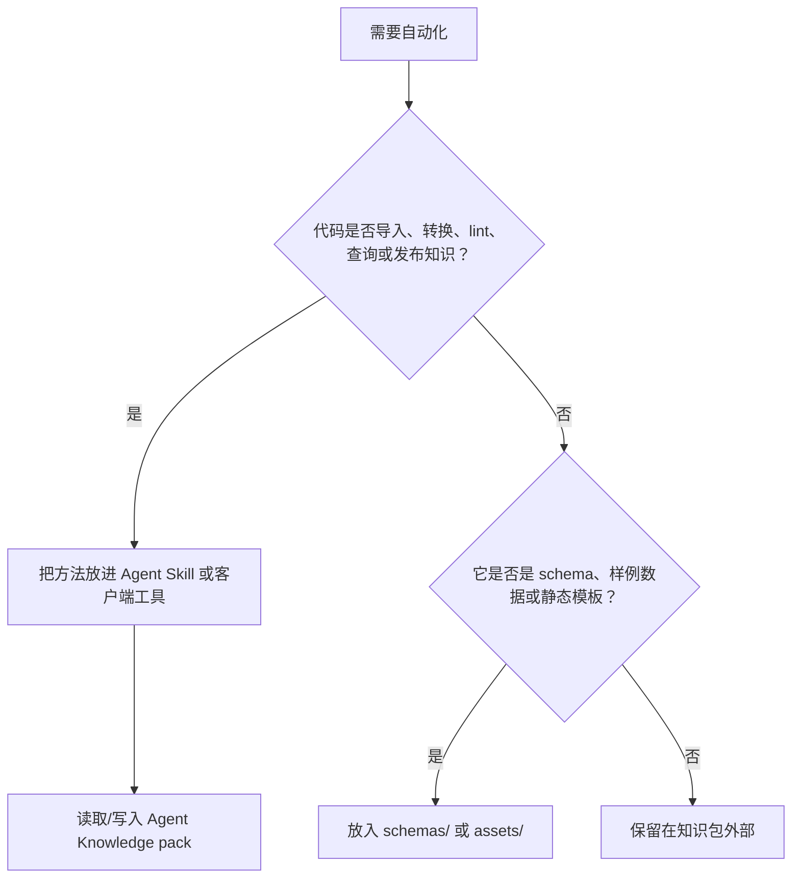

# 维护自动化

Agent Skills 支持内置脚本，因为 Skills 是流程资产。Agent Knowledge 的边界更严格：知识包首先是数据。维护逻辑通常应该放在 Agent Skill、客户端命令、CI 或外部工具中，由它们读取和写入知识包。

本页把 Agent Skills 的脚本实践改写成知识维护规则。

## 边界规则



客户端不得在发现或激活知识包时执行包内代码。

## 推荐放置位置

| 资产 | 推荐位置 | 原因 |
| --- | --- | --- |
| PDF 导入脚本 | Agent Skill `scripts/` 或客户端工具 | 它是方法。 |
| 引用 linter | Agent Skill `scripts/`、CI 或客户端工具 | 它执行校验。 |
| 抽取 claim 的 JSON schema | 知识包 `schemas/` | 它描述数据形状。 |
| 评审 workflow 的静态 prompt 模板 | Agent Skill，或明确非执行的 `assets/` | 如果指导 Agent 做事，就是流程。 |
| 生成的 lint 输出 | 知识包 `runs/` | 它是审计证据。 |
| 发现或回答质量测试用例 | 知识包 `evals/` | 它定义预期行为。 |

## 一次性命令

简单维护可以在维护 Skill 或项目文档中记录带版本的一次性命令：

```bash
npx markdownlint-cli2@0.14.0 "wiki/**/*.md" "compiled/**/*.md"
uvx ruff@0.8.0 check tools/knowledge_lint.py
```

规则：

- 影响评审结果的命令必须锁版本。
- 明确写出前置要求。
- 复杂命令序列应沉淀为已测试脚本。
- 影响知识包状态的结果写入 `runs/`。

## 脚本接口契约

当 Skill 或客户端工具提供知识维护脚本时，脚本应适合 Agent 调用：

- 不使用交互式 prompt。
- `--help` 简洁说明用法和例子。
- 使用结构化输出，机器消费优先 JSON。
- 诊断信息走 stderr，数据走 stdout。
- 路径相对知识包根目录确定。
- 写操作或危险操作提供 `--dry-run`。
- 输出可通过 `--limit`、`--offset` 或 `--output` 控制。
- 尽量幂等。

示例 linter：

```bash
python scripts/lint_knowledge.py \
  --pack ./acme-product-brief \
  --grounding required \
  --output runs/lint-2026-05-01.json
```

示例 JSON 输出：

```json
{
  "status": "needs-review",
  "findings": [
    {
      "severity": "error",
      "path": "compiled/facts.md",
      "message": "价格 claim 缺少来源锚点。"
    }
  ]
}
```

## 自包含脚本

如果维护 Skill 内置脚本，优先使用自包含依赖声明：

- Python 脚本可用 PEP 723 元数据并通过 `uv run` 执行。
- Node 工具可用带版本的 `npx package@version`。
- Deno 脚本可锁定 `npm:` 或 `jsr:` import。
- Go 工具可用 `go run module@version`。

Agent Knowledge 不要求这些 runtime。它们属于维护工具链，不属于知识数据格式本身。

## 状态变更

自动化可以建议状态变更，但客户端不应静默把知识包标为 `ready`，除非所有者策略明确允许。

推荐策略：

| 变更 | 自动化是否允许 | 人工评审 |
| --- | --- | --- |
| `draft` -> `needs-review` | 可以 | 可选 |
| `needs-review` -> `ready` | 仅在策略明确允许时 | 推荐 |
| `ready` -> `stale` | 来源新鲜度检查失败时可以 | 通知 owner |
| `ready` -> `disputed` | 检测到矛盾时可以 | 必须解决 |
| 任意状态 -> `archived` | 默认不允许 | 必须 |

## runs 是证据，不是权威

`runs/` 记录工具做过什么，但不能替代 `wiki/` 或 `compiled/` 中被评审的知识。

解析器可以把 run findings 作为告警展示，但当前知识包状态和选中上下文仍来自 `KNOWLEDGE.md` 和维护后的文件。
