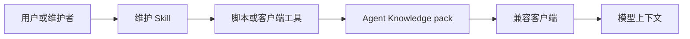

# Skills 互操作

Agent Knowledge 和 Agent Skills 应该分工明确。

- **Agent Knowledge** 保存事实、来源、编译产物、状态、评审和可追溯记录。
- **Agent Skills** 保存流程、脚本、工具调用、提示模板和维护方法。

一个健康生态应该用 Skills 维护 Knowledge，而不是把真实客户、品牌、研究或组织知识写进全局 Skill。

## 分层模型

维护 Skill 可以创建、编译、lint、评估和发布知识包。兼容客户端在发现或激活知识包时，仍然只把知识当数据加载，不能执行知识包里的内容。

## Companion Skill

推荐把知识维护流程沉淀为 companion Skill，例如 `agent-knowledge-maintainer`。

它可以提供：

- 创建知识包。
- 导入来源并规范化 metadata。
- 编译 `sources/ -> wiki/ -> compiled/ + indexes/`。
- 运行健康检查和引用检查。
- 运行 discovery、context 和 answer eval。
- 生成版本快照和 changelog。

这些能力属于流程层，应该放在 Skill、客户端命令、CI 或外部工具中。知识包可以保存 schema、eval case、run record 和示例数据，但不应该要求客户端自动执行包内脚本。

## 脚本边界

如果 companion Skill 使用脚本，脚本应遵循 [维护脚本契约](/zh/authoring/maintenance-script-contract)：

- 写操作支持 `--dry-run`。
- 输出机器可读 JSON。
- 诊断走 stderr。
- 依赖和运行器锁版本。
- 网络访问和凭证使用必须显式声明。

## 不进入知识包核心的内容

以下内容可以作为 Skill 或工具链存在，但不应成为 Agent Knowledge 的必需协议：

- `scripts/` 目录。
- 特定 LLM、编辑器、向量库或图数据库。
- 特定包管理器。
- 具体导入器、爬虫或转换器。
- 针对某一客户端的专有命令。

Agent Knowledge 的可移植单元仍然是普通目录和 Markdown/JSON 工件。

## 互操作原则

- Skill 可以写知识包，但知识包不能要求客户端执行 Skill。
- Skill 输出必须留下 `runs/` 记录，说明读了什么、改了什么、为什么需要评审。
- 知识包的 `status`、`trust` 和 `grounding` 仍由包自身 metadata 和评审结果决定。
- 客户端可以调用维护 Skill，但运行时回答应通过 resolver 读取已维护的知识工件。
