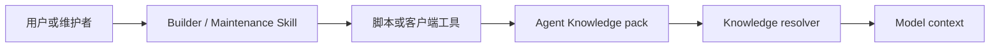

# Skills 互操作

Agent Knowledge 和 Agent Skills 是互补标准。

- **Agent Skills** 是能力与工艺层，遵循 `agentskills.io` 的核心包结构：`SKILL.md`、frontmatter、`references/`、`scripts/`、`assets/` 等。
- **Agent Knowledge** 是知识资产层，提供 `KNOWLEDGE.md`、`documents/`、`sources/`、`wiki/`、`compiled/`、`runs/` 等可审计工件。

推荐放置方式：用 Skills 生产、维护、校验和应用 Knowledge；把具体客户、品牌、研究、组织或运营知识保留在 Knowledge packs 中。

## 分层模型


```mermaid
flowchart LR
  User["用户或维护者"] --> Skill["Builder / Maintenance Skill"]
  Skill --> Tool["脚本或客户端工具"]
  Tool --> Pack["Agent Knowledge pack"]
  Pack --> Resolver["Knowledge resolver"]
  Resolver --> Model["Model context"]
```

Builder Skill 可以创建、编译、lint、评估和发布知识包。兼容客户端在发现和激活 Knowledge 时仍然把知识当数据，不能执行知识包中的内容。

运行时激活保持分离：Skills runtime 注入 `SKILL.md` 作为流程；Agent Knowledge runtime 选择 `documents/` 切片、`compiled/`、`wiki/` 或 source anchors，并把它们包裹为数据。见 [运行时标准](/zh/client-implementation/runtime-standard)。


## Builder Skill provenance

如果 Knowledge pack 由 Skill 生成或维护，SHOULD 在 `KNOWLEDGE.md.metadata.producedBy` 和 `runs/compile-*.json` 中记录 provenance：

```yaml
metadata:
  primaryDocument: documents/main.md
  producedBy:
    kind: agent-skill
    name: personal-ip-knowledge-builder
    version: 1.0.0
    digest: sha256:example
```

```json
{
  "run_id": "compile-2026-05-07T10-00-00Z",
  "trigger": "manual",
  "status": "passed",
  "profile": "document-first",
  "builder_skill": {
    "name": "personal-ip-knowledge-builder",
    "version": "1.0.0",
    "digest": "sha256:example"
  },
  "primary_document": "documents/main.md",
  "inputs": [{ "path": "sources/interview.md" }],
  "outputs": [{ "path": "documents/main.md", "operation": "updated" }]
}
```

provenance 只说明知识产物从哪里来，不表示运行时要执行该 Skill。

## Companion Skill

推荐把维护工作流沉淀为 companion Skill，例如：

- `personal-ip-knowledge-builder`
- `brand-product-knowledge-builder`
- `content-operations-knowledge-builder`
- `private-domain-operations-knowledge-builder`
- `agent-knowledge-maintainer`

这些 Skill 可以提供：

- 创建知识包。
- 导入 sources 并规范化 metadata。
- 编译 `sources/ -> documents/ -> compiled/splits/` 或 `sources/ -> wiki/ -> compiled/`。
- 运行健康检查、引用检查和质量自检。
- 运行发现、上下文和回答 eval。
- 生成版本快照和变更记录。

这些能力属于工艺层，SHOULD 存在于 Skill、客户端命令、CI 或外部工具。知识包 MAY 保存 schemas、eval cases、run records 和 sample data，但 MUST NOT 要求客户端执行内置脚本。

## 脚本边界

如果 companion Skill 使用脚本，脚本 SHOULD 遵循 [维护脚本契约](/zh/authoring/maintenance-script-contract)：

- 写操作支持 `--dry-run`。
- 输出机器可读 JSON。
- 诊断输出到 stderr。
- 依赖和运行器锁版本。
- 网络访问和凭证使用必须显式声明。

Knowledge runtime MUST NOT 在发现、激活或上下文解析阶段执行这些脚本。

## 不进入知识包核心的内容

以下内容 MAY 作为 Skill 或工具链存在，但 MUST NOT 成为 Agent Knowledge 的必需协议：

- `scripts/` 目录。
- 特定 LLM、编辑器、向量库或图数据库。
- 特定包管理器。
- 具体导入器、爬虫或转换器。
- 针对某一客户端的专有命令。
- 完整 Agent 工作流或工具授权策略。

Agent Knowledge 的可移植单元仍然是普通目录和 Markdown/JSON 工件。

## 互操作原则

- Agent Knowledge 不 fork Agent Skills；它是同一生态下的知识资产伙伴标准。
- Skill 可以写知识包，但知识包不能要求客户端执行 Skill。
- Skill 输出必须留下 `runs/` 记录，说明读了什么、改了什么、为什么需要评审。
- 知识包的 `status`、`trust`、`grounding`、`profile` 和 `runtime.mode` 仍由包自身 metadata 和评审结果决定。
- 客户端 MAY 调用维护 Skill，但运行时回答 SHOULD 通过 resolver 读取已维护的知识工件。
