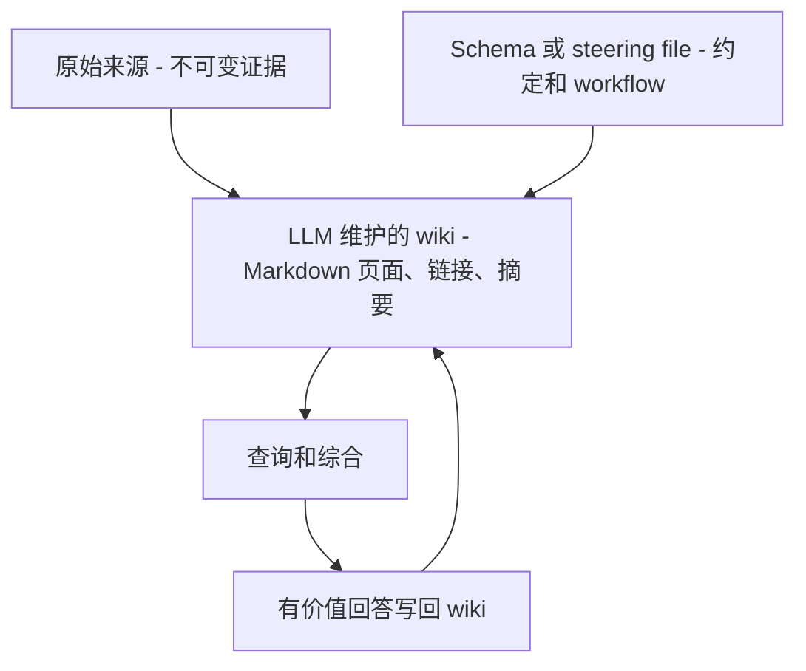
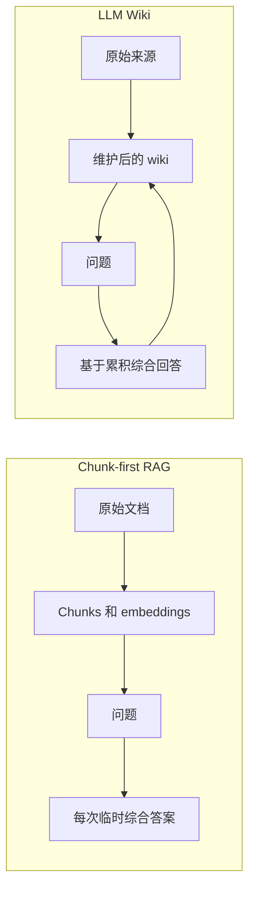
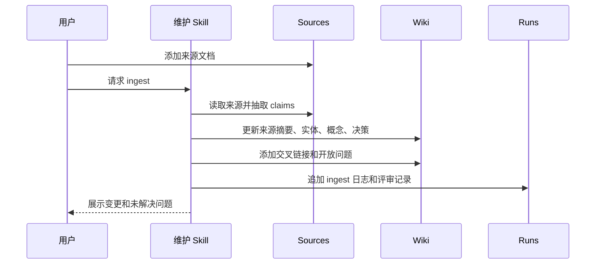
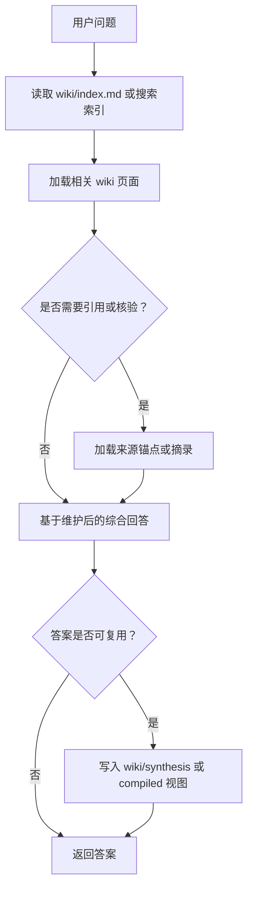

# Karpathy LLM Wiki 模式

本页来源于 Andrej Karpathy 在 2026-04-04 发布的 gist：[LLM Wiki](https://gist.github.com/karpathy/442a6bf555914893e9891c11519de94f)。这篇 gist 本质上是一份 idea file：它提出一种知识维护模式，并让用户的 LLM agent 根据具体领域去实例化细节。

Agent Knowledge 把 LLM Wiki 视为最重要的设计输入之一。标准做的是把这个理念变成可移植的包契约：`sources/`、`wiki/`、`compiled/`、`indexes/`、`runs/`、`schemas/`、`evals/`，以及一个顶层 `KNOWLEDGE.md`，告诉 Agent 如何安全使用这个包。

## 核心论点

Karpathy 的核心判断是：很多基于文档的 LLM 系统仍然是 chunk-first RAG。它们保存原始文档，在查询时检索片段，然后每次都让模型临时综合答案。

LLM Wiki 改变的是知识积累方式：

- LLM 读取经过选择的来源。
- 抽取持久事实、实体、概念、矛盾和摘要。
- 写入或更新相互链接的 Markdown 页面。
- 维护索引和时间顺序日志。
- 未来回答优先使用已经维护好的 wiki。
- 把有复用价值的分析再写回 wiki，让探索可以累积。

关键变化是从 **每次检索原始 chunks** 变成 **维护一个持久综合工件**。

## 三层架构

Karpathy 描述的是三层概念结构：



映射到 Agent Knowledge：

| Karpathy 层 | Agent Knowledge 映射 | 职责 |
| --- | --- | --- |
| 原始来源 | `sources/` | 不可变或 append-only 证据。默认 LLM 只读不改。 |
| Wiki | `wiki/` | 被维护的实体、概念、决策、综合、来源页面。 |
| Schema / steering file | `KNOWLEDGE.md`、`schemas/`、维护 Skills | 定义结构、约定、导入/查询/lint 工作流和抽取契约。 |
| Index 和 log | `wiki/index.md`、`wiki/log.md`、`indexes/`、`runs/` | 人和 Agent 的导航、时间线、可重建加速层。 |
| 运行时回答 | `compiled/` 和新的 `wiki/` 页面 | 紧凑视图和可复用分析。 |

注意：在 Agent Knowledge 中，`compiled/` 不是“所有编译产物”的唯一目录。LLM Wiki 的主要编译产物是 `wiki/`：它保存长期结构、链接、矛盾和来源关系。`compiled/` 是从 `wiki/` 派生的运行时视图，用来把常用上下文压缩给模型。

## 为什么它不是普通 RAG



RAG 仍然有价值。LLM Wiki 的主张更窄：对长期知识工作，单靠原始检索会丢掉可积累结构。维护后的 wiki 能保留交叉引用、矛盾、开放问题、综合页面和决策历史。

因此 Agent Knowledge 把索引当可选加速层，而不是事实源。事实源仍然是来源文件和被维护的 Markdown 工件。

## 操作模型

完整编译契约见 [编译模型](/zh/authoring/compilation-model)。

### Ingest

Ingest 是添加一个或多个来源并更新 wiki。

推荐流程：



一个来源可能更新很多页面：来源摘要、实体页面、概念页面、对比页面、矛盾记录和索引。这种多页面更新正是 LLM Wiki 的价值所在；wiki 会随时间变得更丰富。

### Query

查询应优先使用维护后的 wiki，再回退到 sources 做证据核验。



在 Agent Knowledge 中，可复用查询结果应在评审后成为 `wiki/synthesis/...` 页面或紧凑的 `compiled/...` 视图。

### Lint

Karpathy 明确提出需要健康检查。Agent Knowledge 通过 `runs/` 和可选 `evals/` 让它可审计。

Lint 应检查：

- 页面之间的矛盾。
- 被新来源覆盖的过期 claim。
- 没有入链的孤立页面。
- 重要概念缺少页面。
- 缺少交叉引用。
- claim 缺少来源锚点。
- 需要新来源的开放问题。
- 不应该持久化的噪声页面。

### Index 和 log

Karpathy 特别强调两个文件：

| 文件 | LLM Wiki 中的作用 | Agent Knowledge 建议 |
| --- | --- | --- |
| `index.md` | 面向内容的 wiki 页面目录 | 保留为 `wiki/index.md`；包含页面链接、摘要、分类和新鲜度。 |
| `log.md` | 追加式时间顺序记录 | 保留为 `wiki/log.md` 或 `runs/`；用可解析 heading 记录 ingest、query、lint、review 事件。 |

中小规模时，维护好的 index 可能足够。更大规模时，用 `indexes/` 保存全文、BM25、向量或图索引。这些索引必须能从 `sources/`、`wiki/` 和 `compiled/` 重建。

## 推荐的 Agent Knowledge 目录

```text
research-topic/
├── KNOWLEDGE.md
├── sources/
│   ├── articles/
│   ├── papers/
│   └── transcripts/
├── wiki/
│   ├── index.md
│   ├── log.md
│   ├── sources/
│   ├── entities/
│   ├── concepts/
│   ├── decisions/
│   ├── contradictions/
│   ├── open-questions/
│   └── synthesis/
├── compiled/
│   ├── briefing.md
│   ├── facts.md
│   └── boundaries.md
├── indexes/
│   ├── full-text/
│   ├── vector/
│   └── graph/
├── schemas/
│   ├── claim.schema.json
│   └── page-frontmatter.schema.json
├── evals/
│   ├── discovery.validation.json
│   └── answer-quality.json
└── runs/
    ├── ingest-2026-05-01.md
    └── lint-2026-05-01.json
```

## 页面类型

| 页面类型 | 位置 | 作用 |
| --- | --- | --- |
| 来源摘要 | `wiki/sources/<source-id>.md` | 总结单个来源并链接到原始证据。 |
| 实体页 | `wiki/entities/<entity>.md` | 跟踪人物、公司、产品、地点、系统。 |
| 概念页 | `wiki/concepts/<concept>.md` | 跟踪定义、论点、机制、术语。 |
| 决策页 | `wiki/decisions/<decision>.md` | 跟踪决定内容、决策人、时间和来源。 |
| 矛盾页 | `wiki/contradictions/<topic>.md` | 跟踪冲突 claim 和解决状态。 |
| 开放问题 | `wiki/open-questions/<question>.md` | 跟踪知识缺口和建议寻找的来源。 |
| 综合页 | `wiki/synthesis/<topic>.md` | 保存多个来源或多次查询形成的持久分析。 |
| 运行时 briefing | `compiled/briefing.md` | Agent 经常选择的紧凑上下文。 |

## Schema 作为 steering

在 Karpathy 的设想里，schema 或 steering file 让 LLM 成为有纪律的 wiki 维护者，而不是普通聊天机器人。Agent Knowledge 把这个职责拆开：

- `KNOWLEDGE.md` 告诉 Agent 什么时候使用该包以及如何导航。
- `schemas/` 定义结构化 claim/page 格式。
- 维护型 Agent Skills 定义 ingest、lint、query、review 工作流。
- `runs/` 记录真实发生过什么。

示例 `KNOWLEDGE.md` 上下文地图：

```markdown
## Context map

- 从 `wiki/index.md` 开始发现页面。
- 短上下文优先使用 `compiled/briefing.md`。
- 做有争议 claim 前先查 `wiki/contradictions/`。
- 只有需要引用或核验时才读取 `sources/`。
- `indexes/` 只用于找候选，不是事实权威。
```

## 人和 LLM 的分工

Karpathy 的模式不是“让模型决定所有知识”，而是协作模型：

| 角色 | 职责 |
| --- | --- |
| 人 | 选择来源、提出问题、评审重要更新、决定什么重要。 |
| LLM | 摘要、交叉引用、更新页面、维护索引/日志、检测矛盾。 |
| 客户端 | 执行信任、文件边界、状态告警、权限和上下文预算。 |
| 维护 Skill | 提供可重复的 ingest、lint、eval、query 工作流。 |

人不应该承担重复 bookkeeping，但仍然拥有来源选择、重点、评审和决策权。

## 讨论中体现的实现经验

gist 下的公开讨论提供了若干实现信号。Agent Knowledge 不标准化这些工具，但应支持它们：

- **规模墙**：`wiki/index.md` 适合中小规模，更大的 wiki 需要搜索和图索引。
- **上下文端点**：resolver 一次返回主页面和图邻域，通常比让模型多轮找文件更稳定。
- **MCP 工具**：search、graph、context endpoint 可以作为 MCP 暴露，让多个 Agent 使用同一份维护后的 wiki。
- **写入前质量门禁**：不是每个抽取事实都值得入库；持久化前过滤噪声往往比优化检索更重要。
- **团队记忆流水线**：聊天和会议数据需要抽取、去重、校验、关系抽取和权限感知持久化。
- **图谱物化**：Markdown links 是好基础；typed graph 有助于矛盾检测、导航和上下文扩展。

这些经验加强了 Agent Knowledge 的分层：维护后的 Markdown、可重建索引、审计 runs、客户端 resolver 各司其职。

## 对 Agent Knowledge 的设计影响

1. `wiki/` 是维护后的工件，不是缓存。
2. `sources/` 必须分离且可追溯。
3. `compiled/` 存在是因为运行时需要紧凑视图，而不是整本 wiki。
4. `indexes/` 可以包含向量、全文和图结构，但必须可重建。
5. `runs/` 是规模化信任所需：ingest、lint、review、query、eval 都要留痕。
6. 维护 workflow 属于 Skills 或客户端工具，不应藏在知识 prose 里。
7. 有复用价值的答案可以变成持久页面，但必须经过评审或明确状态标记。
8. 质量门禁是知识构建的一部分，不是事后补丁。

## Agent Knowledge 与原始 LLM Wiki 的差异

Karpathy 的 gist 有意保持灵活，更偏个人工具和理念。Agent Knowledge 增加更严格的包契约，让多个客户端可互操作：

| LLM Wiki 理念 | Agent Knowledge 标准化 |
| --- | --- |
| 抽象模式 | 带版本的包格式。 |
| Schema file 可因 Agent 而异 | 必需 `KNOWLEDGE.md` 加可选 `schemas/`。 |
| Wiki 结构可自由组织 | 推荐目录和状态字段。 |
| 工具可选 | 明确 `indexes/`、`runs/`、`evals/` 约定。 |
| 人/LLM workflow 偏本地 | 增加客户端信任、激活和运行时上下文指导。 |

## 非目标

Agent Knowledge 不要求 Obsidian、MCP、图数据库、向量数据库或特定 LLM。它首先应该作为普通 Git 目录工作。

这些工具可以提升体验，但可移植单元仍然是知识包。
