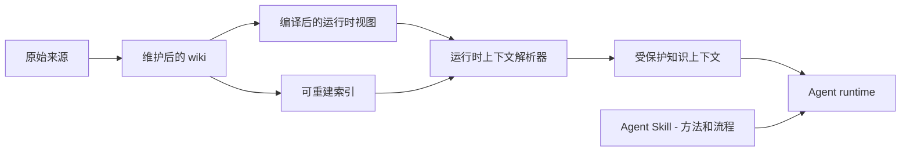

# 什么是 Agent Knowledge？

Agent Knowledge 是一种可移植目录格式，用来把长期知识资产打包给 AI Agent 使用。

适合承载：

- 品牌和产品事实
- 组织 Know-how
- 个人、专家、创始人画像
- 长期研究 wiki
- 客服和销售 playbook
- 政策、合规、领域参考

它不是 Agent Skills 的替代品。Agent Skills 告诉 Agent 如何执行任务；Agent Knowledge 告诉 Agent 可以依赖哪些事实、来源、上下文和边界。

## 解决的问题

很多系统把知识放在两个地方：

- 只有向量库，缺少人可读结构。
- 只有 prompt 或 Skill 文件，把事实和指令混在一起。

当知识需要维护、评审、引用和跨 Agent 复用时，两者都会出问题。

Agent Knowledge 分层：

```text
raw sources -> maintained wiki -> compiled runtime views -> optional indexes
```

## 核心架构



Skill 层提供方法和流程；Knowledge 层提供有来源的上下文。Agent runtime 只在通过信任、状态和溯源检查后合并二者。

## 核心原则

1. 文件优先：知识包是人和 Agent 都能检查的目录。
2. 来源分离：原始来源是证据，不默认作为运行时 prompt。
3. 知识是数据：客户端必须把加载的知识当上下文，不当指令。
4. 渐进加载：先元数据，再指南，再按需上下文和证据。
5. 索引可重建：向量、全文、图索引只是加速层。
6. 显式状态：draft、ready、stale、disputed、archived 不同行为。
7. Skills 仍是流程层：用 Skills 去导入、校验、查询和应用知识包。
